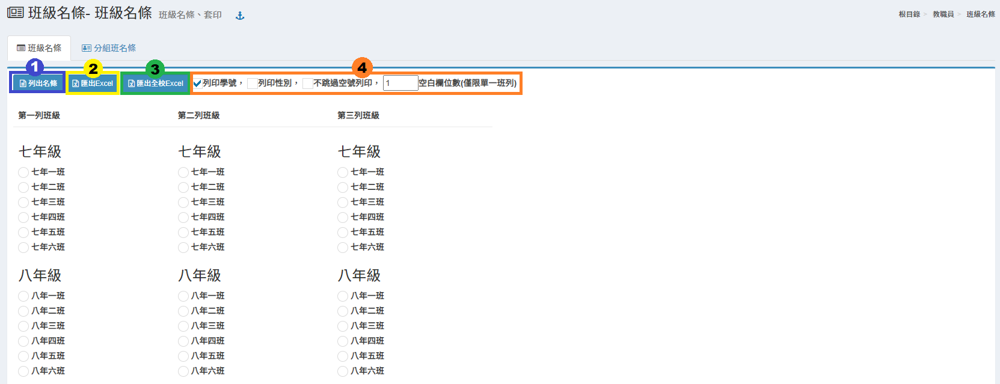

# 班級名條

## 班級名條

1. 至少在第一列中選擇一班，按&#x4E0B;**「列出名條」**&#x5373;可列出所選班級名條並列印。
2. 選擇班級後可以按&#x4E0B;**「匯出Excel」**&#x4E0B;載班級名條。
3. 或可按&#x4E0B;**「匯出全校Excel」**&#x4E0B;載全校班級名條。
4. 勾選名條是否含有「學號」、「性別」欄位，或不跳過空號列印，輸入顯示空白欄位數。

## 分組班名條

1. 至少在第一列中選擇一班，按&#x4E0B;**「列出名條」**&#x5373;可列出所選分組班級名條並列印。
2. 選擇班級後可以按&#x4E0B;**「匯出分組Excel」**&#x4E0B;載分組班級名條。
3. 或可按&#x4E0B;**「匯出全校分組Excel」**&#x4E0B;載全校分組班級名條。
4. 勾選是否有性別欄位。
