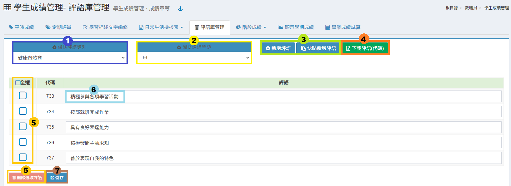
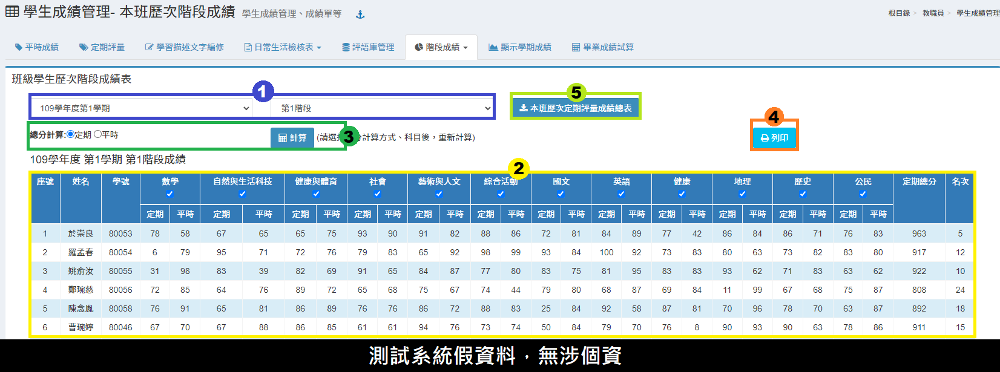

# 學生成績管理

## 平時成績

1. 選&#x64C7;**「班級-任教科目」**、**「階段別」**。
2. 勾選是否顯&#x793A;**「學生大頭照」**。
3. 按&#x4E0B;**「新增一項成績」**，會彈出快顯示窗，可新增多筆平時成績。
4.  編輯成&#x7E3E;**「名稱」**、**「加權」**，按&#x4E0B;**「確定」**。

    每筆平時成績皆能自行設定其加權，平均會依照加權數計算。加權數至少為 1 才會列入計算。
5. 在成績欄位中可透過多種方式輸入成績：快顯示窗輸入、頁面中輸入、Excel 快貼，亦可刪除成績。
6. 完成階段的平時成績輸入，務必按&#x4E0B;**「匯到定期評量成績」**，點擊後系統才會計算成績並匯入定期評量，畫面將自動跳轉至定期評量成績輸入頁面。
7. &#x53EF;**「下載成績 Excel 檔」**。

## 定期評量

.png>)

1. 選&#x64C7;**「班級-任教科目」**、**「階段別」**。
2. 勾選是否顯&#x793A;**「學生大頭照」**。
3. 在成績欄位中可透過多種方式輸入成績：快顯示窗輸入、頁面中輸入、Excel 快貼，亦可刪除成績。
4. 也可以匯入成績 Excel 檔。
5. &#x53EF;**「結算學期成績」**（期末適用，會結算每個階段成績）。
6. 完成定期評量成績輸入，並確認無誤後，務必按&#x4E0B;**「匯送到教務處」**，成績將會上鎖、不得修改。若仍需修改，請聯繫教務處解鎖。
7. &#x53EF;**「下載成績 Excel 檔」**。

## 學習描述文字編修

<figure><figcaption></figcaption></figure>

1. 選&#x64C7;**「任教班級-科目」**。
2. 選&#x64C7;**「努力程度」**，可按下標題列的鍵盤圖示，可一次設定全班學生的努力程度，在個別進行編修。
3. 如是輸入本土語文、新住民語文、台灣手語領域科目，該處會顯&#x793A;**「語言類型」** 欄位。<mark style="color:red;">\*</mark><mark style="color:red;">**學資網Q2檢核重點，請務必正確填寫學生的語文語言類型。**</mark>
4. 輸&#x5165;**「學習描述文字」**，或是點選最右側的圖示，會彈出快顯視窗，即可選擇預設的評語或自訂的評語。
5. &#x53EF;**「顯示上學期評語」**。
6. 可將 Excel 的描述文字匯入系統，按&#x4E0B;**「使用快貼輸入學習描述文字」**，並參照系統說明匯入。
7. 點&#x64CA;**「下載學期成績」**&#x53EF;下載該科目學期成績。

## 日常生活檢核表

### 填寫日常生活檢核表

1. 勾選學&#x751F;**「表現狀況」**。
2. 填&#x5BEB;**「具體建議」**。
3. 輸&#x5165;**「日常生活表現」**、**「團體活動紀錄」**、**「公共服務紀錄」**，日常生活表現可合併列出上列建議。亦可使用範例檔快貼匯入。
4. 輸入校內外特殊表現紀錄，亦可從輔導紀錄的特殊表現匯入，請勾選「列示已登載的輔導資料」，並點選複製至校內／校外表現即可直接匯入。
5. 按&#x4E0B;**「儲存」**，儲存該次編輯。


輔導紀錄>特殊表現，可匯入學生榮譽榜資料。因此要在日常生活檢核表匯入特殊表現時，請先確認 [輔導紀錄>特殊表現](../undefined-1/sheng-guan-li.md#te-shu-biao-xian) 是否有資料。


### 日常生活表現列表

> 此處填入的資料即是「日常生活檢核表中的**日常生活表現**」，也是「學期成績單中的**日常生活評語**」。

1. 選&#x64C7;**「班級」。**
2. 輸&#x5165;**「日常行為表現描述文字」**&#x6216;是點選最右側的對話框圖示，會彈出快顯視窗，即可選擇預設的評語或自訂的評語。
3. 按&#x4E0B;**「儲存」**。
4. 也可以使&#x7528;**「快貼輸入」**&#x6279;次處理學生日常行為表現評語，請參照使用說明操作。

## 評語庫管理

提供教師可自行設訂常用評語庫。

1. 選擇「**評語類別」**，按&#x4E0B;**「齒輪圖示」**&#x53EF;新增、編修類別。
2. 選&#x64C7;**「評語等級」**，按&#x4E0B;**「齒輪圖示」**&#x53EF;新增、編修等級。
3. 按&#x4E0B;**「新增評語」**&#x65B0;增一則評語，按&#x4E0B;**「快貼新增評語」**&#x53EF;一次新增多則評語。
4. &#x53EF;**「下載評語(代碼)」**，方便教師直接輸入代碼登打評語。
5. 勾選評語後，&#x53EF;**「刪除評語」**。
6. 點擊評語欄位可直接編修評語。
7. 按&#x4E0B;**「儲存」**，儲存該次編輯。

## 階段成績

### 本學期階段成績

本功能可查詢本學期任課班級學生階段成績。

1. 選&#x64C7;**「班級」**、**「階段別」**、**「顯示模式」**。
2. 勾選統計的選項。
3. 勾選或取消勾選統計的科目，預設為全選。
4. 按&#x4E0B;**「列印」**，可列印當前設定的成績結果。
5. 也可以將成績結&#x679C;**「匯出將 Excel 檔」**。

### 本班歷次階段成績

1. 選&#x64C7;**「學期」**、**「階段別」**。
2. 標示處顯示該班該次階段成績總表。
3. 可點選總分計算方式及科目重新計算。
4. 可&#x4EE5;**「列印」**&#x6210;績查詢結果。
5. 可&#x4EE5;**「下載」**&#x672C;班歷次定期評量成績歷年總表。

## 顯示學期成績

1. 選擇顯&#x793A;**「分科總表」**&#x6216;**「領域總表」**。
2. 標示處顯示該班成績總表。
3. 可&#x4EE5;**「列印」**&#x6216;**「下載 Excel 檔」**。

## 畢業成績結算

1. 選擇&#x5404;**「領域加權」**，或勾&#x9078;**「使用用課程設定加權」**&#x6578;值（勾選後，系統會直接運算課程加權分數，不需另外選擇右側科目權重欄位）。
2. 選擇&#x5404;**「學期加權比重」**。
3. 填&#x5165;**「名次列印名數」**。
4. 按&#x4E0B;**「計算」**。
5. 標示處顯示試算結果。
6. &#x53EF;**「列印」**，&#x6216;**「下載 Excel」**&#x6A94;案。
