# 成績綜合管理

## 定期評量

### 成績查詢

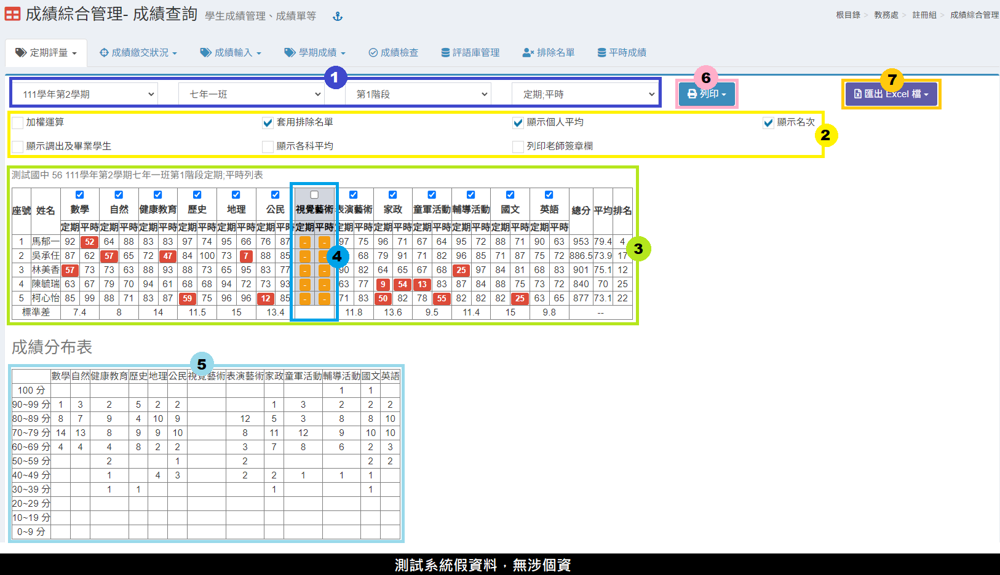

1. 選&#x64C7;**「學期」**、**「班級」**、**「階段別」**、**「成績顯示模式」**。
2. 可勾選額外計算選項：加權運算、顯示調出生及畢業學生、套用排除名單、顯示各科平均、顯示個人平均、列印老師簽章欄、顯示名次。
3. 該班學生成績顯示在標示處。
4. 可**取消勾選某科目**，該科目則不列入總分計算。
5. 可查看成績組距分布結果。
6. &#x53EF;**「列印」**&#x8A72;班成績，&#x6216;**「匯出」**&#x8A72;班或全年級成績 Excel 檔。

### 定期評量-優異排名

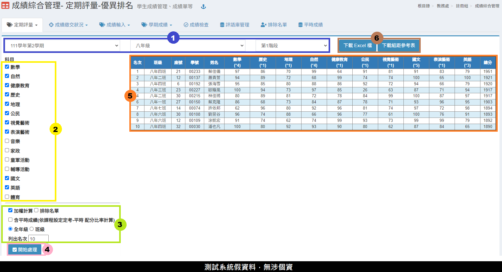

1. 選&#x64C7;**「學期」**、**「班級」**、**「階段別」**。
2. 選擇要計算優異排名&#x7684;**「科目」**。
3. 勾選是&#x5426;**「加權計算」**、**「套用排除名單」**、**「含平時成績」**，選擇計&#x7B97;**「全年級」**&#x6216;**「該班級」**&#x53CA;輸&#x5165;**「列出名次」**。
4. 按&#x4E0B;**「開始處理」**。
5. 統計結果顯示在標示處。
6. 可下&#x8F09;**「統計結果 Excel 檔」**&#x4EE5;&#x53CA;**「組距參考表」**。


若有學生成績須排除在外，請先至 [排除名單](cheng-he-guan-li.md#pai-chu-ming-chan) 設定學生。


### 定期評量-各班平均

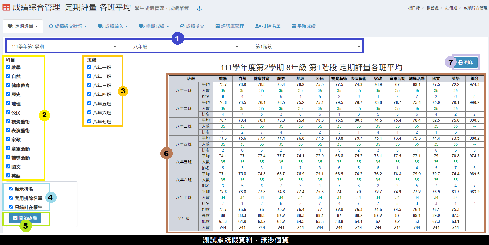

1. 選&#x64C7;**「學期」**、**「年級」**、**「階段別」**。
2. 選擇要平均&#x7684;**「科目」**。
3. 選擇要計算&#x7684;**「班級」**。
4. 勾選是&#x5426;**「顯示排名」**、**「套用排除名單」**、**「只統計在籍生」**。
5. 按&#x4E0B;**「開始處理」**。
6. 統計結果顯示在標示處。
7. &#x53EF;**「列印」**&#x8A72;次統計結果。

### 定期評量-歷次總表

> 可下載班級歷年階段成績總表

.png>)

1. 選&#x64C7;**「年級」**。
2. 勾選要輸出成績&#x7684;**「班級」**。
3. 勾選要輸出成績&#x7684;**「學期」**。
4. 按&#x4E0B;**「下載 Excel」**，Excel 檔案會依照班級、階段呈現學生成績。
5. 如欲下載橫式檔案格式，請按&#x4E0B;**「下載橫式excel」**。

### 階段成績轉班

學期中轉班生階段成績轉班作業


操作階段成績轉班前，請先將學生調整到新班級。請參照[學生資料管理＞學期編班](sheng-liao-guan-li.md#xue-qi-bian-ban-1)。


1. 選擇轉班後的學生。
2. 選擇轉班前的階段成績。
3. 勾選要移轉成績的科目，預設為全選。
4. 按&#x4E0B;**「搬移成績」**。
5. 搬移成功後，標示處會呈現新班級的成績。


* 新班級有輸入科目成績，如也列入須轉移之科目，會先將新班級之科目成績刪除，再將舊班級之科目成績移轉至新班級科目成績。
* 如果有出現該生原班學期成績， 請務必刪除原班學期成績!!若沒有刪除， 該生會有兩筆學期成績造成學期成績統計錯誤!! 刪除之後就不會再出現。


## 成績繳交狀況

### 成績繳交狀況

.png>)

.png>)

1. 選&#x64C7;**「學期」**、**「年級」**、**「階段別」**。
2. 若任課老師已完成全班學生成績輸入，圖示會顯示為綠色。**鎖頭圖示**表示成績已匯至教務處，任課老師無法修改，**按一下可解鎖**。
3. 若班級有部分學生成績未輸入，則會顯示未輸入人數，且圖示為紅色。**鎖頭圖示**表示成績已匯至教務處，任課老師無法修改，**按一下可解鎖**。
4. 若全班成績都沒有輸入，則顯示 ✘ **圖示**。
5. 點擊此&#x8655;**「鎖頭圖示」**&#x53EF;批次鎖定及開鎖。
6. 按&#x4E0B;**「計算機」**&#x5716;示，可結算班級學期成績。
7. 勾選需求的列印項目後再勾選班級，&#x53EF;**「列印」**&#x73ED;級階段成績檢核表。
8. 按&#x4E0B;**「放大鏡」**&#x5716;示，可查看該班學生成績。
9. 可於此處設&#x5B9A;**「階段／學期成績開放查詢時間」**，會影響學生作業模組可查詢成績的時間，請詳見系統上的說明。
10. 如已有設定日期並儲存，即可點&#x64CA;**「複製到各年級」**，將此日期設定複製至各年級。

### 成績繳交狀況 - 分組班

1. 選&#x64C7;**「年級」**、**「階段別」**，即可查看分組科目成績狀況。
2. 標示處顯示成績繳交狀態，圖示意義請參考系統內說明。

### 努力程度及評語繳交狀況

1. 選&#x64C7;**「學期」**、**「年級」**。
2. 若班級有部分學生成績未輸入，則會顯示未輸入人數，以及呈現**黑色？**；若全班已輸入，則呈現**藍色✓**；若全班未輸入，則呈現**紅色 ✘**。點擊任一圖示，可查該班科目的努力程度、評語。
3. 按&#x4E0B;**「放大鏡」**，可查看該班所有科目的努力程度、評語。

### 分組努力程度及評語繳交狀況

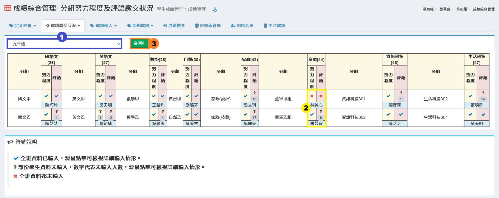

1. 選&#x64C7;**「年級」。**
2. 若班級有部分學生成績未輸入，則會顯示未輸入人數，以及呈現**黑色？**；若全班已輸入，則呈現**藍色✓**；若全班未輸入，則呈現**紅色 ✘**。點擊任一圖示，可查該分組班科目的努力程度、評語，如下圖。

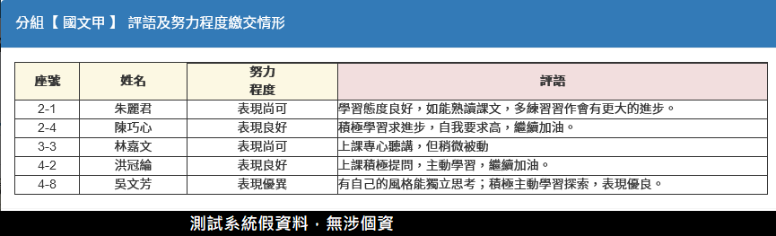

### 本土、新住民、臺灣手語語系註記狀況

> 此模組供行政端檢核各學期各年班的語系註記情況。

<figure>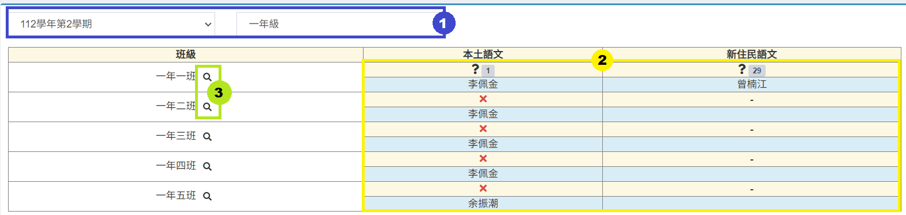<figcaption></figcaption></figure>

1. 選擇學期年班。
2.  此處顯示各班語系註記狀況，如該班有該領域科目才會顯示。\
    &#x20;<mark style="color:green;">**V**</mark>**&#x20;全班資料已輸入。**

    &#x20;**? 部份學生資料未輸入，數字代表未輸入人數。**

    &#x20;<mark style="color:red;">**X**</mark>**&#x20;全班資料都未輸入**
3. 點擊放大鏡可查看班級輸入細項。


如科目未於＂學期初設定＞配課＂配課給任課老師，則無法顯示結果。


## 成績輸入

### 班級階段成績

1. 選&#x64C7;**「學期」**、**「班級」**、**「科目」**、**「階段別」**。
2. 在欄位中輸入學生成績。
3. 按下藍色圖示，可以在跳出視窗內輸入或修改成績。
4. 按下綠色圖示，可快貼 Excel 中的學生成績。請參考快貼說明操作。
5. 按&#x4E0B;**「儲存」**，儲存該次編修結果。

### 個人階段成績

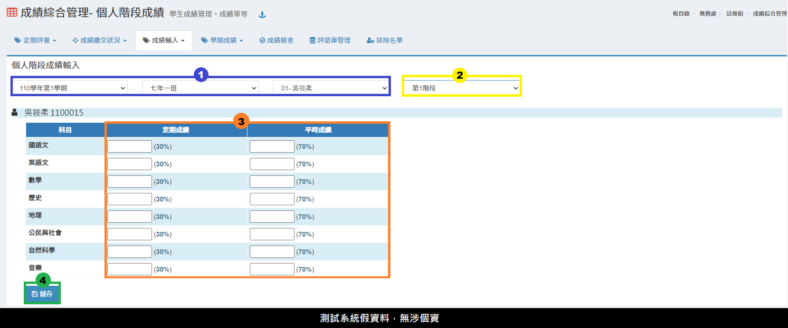

1. 選&#x64C7;**「學期」**、**「班級」**、**「學生」**。
2. 選擇要輸入成績&#x7684;**「階段」**。
3. 在標示處可編輯學生個人階段成績。
4. 按&#x4E0B;**「儲存」**，儲存該次編修。

### 個人學期成績

1. 選&#x64C7;**「學期」**、**「班級」**、**「學生」**。
2. 選擇要輸入成績&#x7684;**「學期」**。
3. 在標示處可編輯學生**努力程度**、**成績**、**評語**。
4. &#x53EF;**「刪除」**&#x5B78;生成績。
5. 按&#x4E0B;**「儲存」**，儲存該次編修。

### 彈性-社團活動成績


* 請先在「學期初設定」之「12年國教科目設定」中設定 「社團活動」課程事項。
* 本功能不提供九年一貫科目社團活動之成績處理。


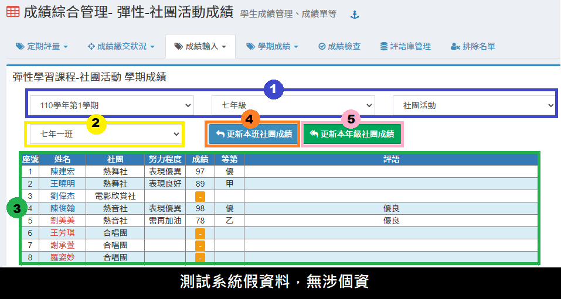

1. 選&#x64C7;**「學期」**、**「年級」**、**「科目」**。
2. 選&#x64C7;**「班級」。**
3. 標示處顯示學生成績狀態&#x20;
4. 按&#x4E0B;**「更新本班成績」**，可以更新本班社團成績。
5. 按&#x4E0B;**「更新本年級社團成績」**，可以更新本年級社團成績。


* 如果要使用本功能匯入社團成績，且要避免排課教師輸入社團成績，請於學期初設定將社團教師配課刪除(課程設定不能修改)。
* 在成績管理之成績繳交狀況無法看見匯入成績否，因為本成績是直接匯入學期成績。


### 本土、新住民、臺灣手語語系設定

> 此模組功能提供行政端補登過往學期班級本土、新住民、臺灣手語語言類型。

<figure>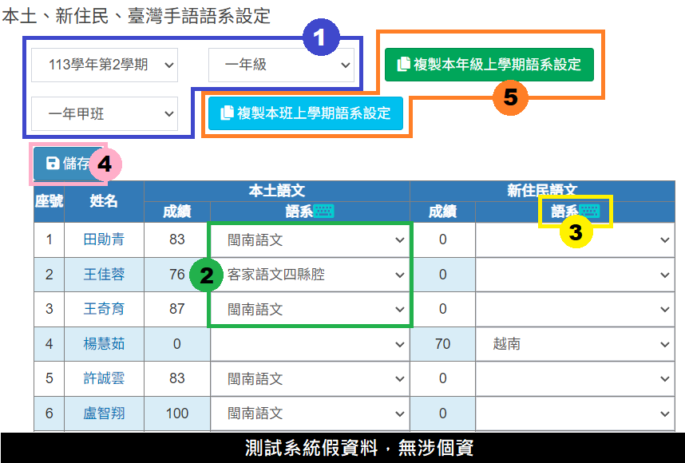<figcaption></figcaption></figure>

1. 選擇相對應的學期年班資訊。
2. 選擇學生修習的語言語系類型。\
   <mark style="color:red;">※各語文領域類型語系有相關規範，如新住民語系就必須為＂語文－新住民語＂領域下方能選擇。</mark>
3. 鍵盤按鈕可預設列表為相同語系進行批次設定。
4. 處理完畢後請記得「儲存」。
5. 於「 第二學期 」，系統會顯示複製功能，可使用「複製本班上學期語系設定」或「複製本年級上學期與設定」，一鍵複製學生上學期的語言語系類型。\
   <mark style="color:red;">※僅第二學期提供複製功能，第一學期無此功能。</mark>


此模組與任課老師於＂[學習描述文字編修](../jiao-1/sheng-cheng-guan-li.md#xue-xi-miao-shu-wen-zi-bian-xiu)＂設定的語系連動，因科任老師無法處理非本學期作業，故此模組主要功能是提供行政端可以進行非本學期資料補登。



複製上學期語系設定功能注意事項：

* 複製功能係以班級序號為判斷依據，非以班名為依據，所以上下學期班級序號需一致。
* 第二學期才有複製功能，且第二學期該班課程設定與上學期相同，如果第二學期沒有第一學期的科目，則跳過不處理。
* 本學期轉入生(或上學期期末轉入生)上學期未在本校設定語系，無法複製跳過不處理。


## 學期成績

### 學期成績總表

1. 選&#x64C7;**「學期」**、**「班級」**。
2. 選&#x64C7;**「分科總表」**&#x6216;**「領域總表」**。
3. 學生成績會顯示在標示處。
4. &#x53EF;**「列印」**&#x8A72;班學生成績總表。
5. &#x53EF;**「下載全班、全年級分班、全年級」**&#x6210;績總表 Excel 檔。

### 學期成績-優異排名

1. 選&#x64C7;**「學期」**、**「年級」**。
2. 選擇要計算優異排名&#x7684;**「科目」**。
3. 勾選是&#x5426;**「加權計算」**，選擇計&#x7B97;**「全年級」**&#x6216;**「該班級」**，輸入列出名次。
4. 按&#x4E0B;**「開始處理」**。
5. 統計結果顯示在標示處。
6. 可下&#x8F09;**「統計結果 Excel 檔」**。

### 學期成績冊

1. 選&#x64C7;**「學期」**、**「班級」**。
2. 該班學生學期成績記錄會顯示在標示處。
3. &#x53EF;**「列印」**&#x8A72;次統計結果。
4. &#x53EF;**「下載全班、全年級分班 Excel 檔」**。

### 學期領域成績不及格統計

> 本功能會統計學生學期領域不及格(包含轉校生補登學期成績資料)人數，及補考後不及格之人數。

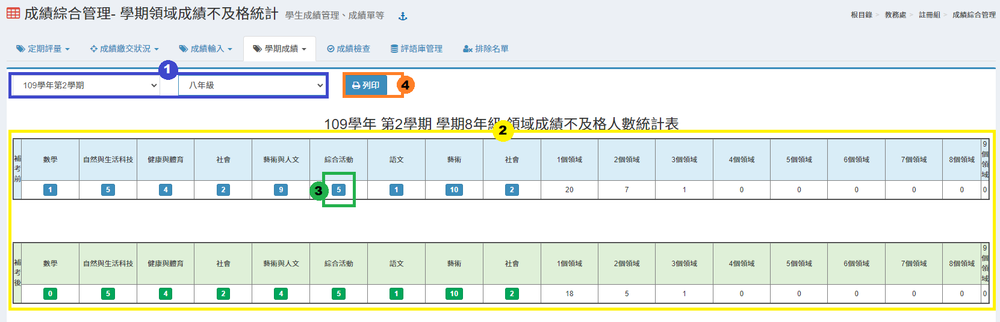

1. 選&#x64C7;**「學期」**、**「年級」**。&#x20;
2. 該年級學期成績不及格人數統計會顯示在標示處。&#x20;
3. 點&#x9078;**「領域不及格人數」**&#x53EF;以顯示該領域不及格名單，如下圖。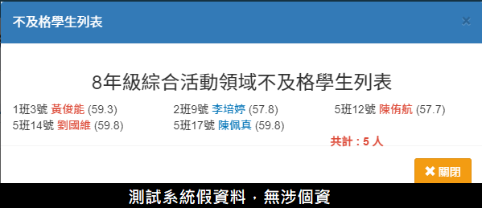
4. &#x53EF;**「列印」**&#x8A72;次統計結果。

### 班級歷年科目學期成績總表

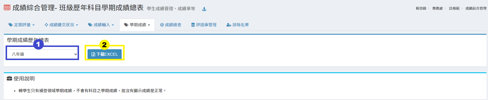

1. 選&#x64C7;**「班級」**。
2. 點&#x64CA;**「下載Excel」**，可下載班級學期成績歷年總表。


轉學生只有補登領域學期成績，不會有科目之學期成績，故沒有顯示成績是正常。


## 成績檢查

> 檢查該學期各階段成績儲存時為「空值」「或超過百分」的學生記錄。

1. 選&#x64C7;**「學期」**、**「年級」**。
2. 選&#x64C7;**「空白成績檢查」**&#x6216;**「百分成績檢查」**。
3. 標示處會顯示成績有「空值」或「超過百分」的紀錄。

## 評語庫管理

.png>)

1. 選&#x64C7;**「評語類別」**，按&#x4E0B;**「齒輪圖示」**&#x53EF;新增、編修類別。
2. 選&#x64C7;**「評語等級」**，按&#x4E0B;**「齒輪圖示」**&#x53EF;新增、編修等級。
3. 按&#x4E0B;**「新增評語」**&#x65B0;增一則評語，按&#x4E0B;**「快貼新增評語」**&#x53EF;一次新增多則評語。
4. &#x53EF;**「下載評語(代碼)」**，方便教師直接輸入代碼登打評語。
5. 勾選評語後，&#x53EF;**「刪除評語」**。
6. 點擊評語欄位可直接編修評語。
7. 按&#x4E0B;**「儲存」**，儲存該次編輯。

## 排除名單

> 適用於班級成績計算時，排除資源班學生成績。

.png>)

1. 選&#x64C7;**「學期」**，並輸入排除學生&#x4E4B;**「學號」**&#x6216;**「座號」**。
2. 輸&#x5165;**「排除原因」**。
3. 按&#x4E0B;**「新增排除學生」**。
4. 按&#x4E0B;**「垃圾桶」**&#x5716;示&#x53EF;**「刪除」**&#x6392;除名單。
5. 按&#x4E0B;**「複製上學期排除學生」**，可複製上學期排除名單資料至本學期。


* 建議不要在學期中任意更動排除名單設定，以免成績計算不如預期，造成學生、家長對學校成績處理失去信心。
* 若要使本列表於計算時生效，請務必於相關頁面勾選「**套用排除名單**」。


## 平時成績

> 可查看在籍生近兩學年內各科目階段平時成績輸入情況。

.png>)

1. 選&#x64C7;**「學期」**、**「年級」**、**「任課老師（科目）」**、**「階段」**。
2. 點&#x64CA;**「列印」**，可列印此平時成績列表。
3. 點&#x64CA;**「下載 EXCEL」**，可下載該平時成績列表。


* 此模組僅供查詢在籍生近兩學年內之科目平時成績。
* 任課老師須於[「教職員＞學生成績管理＞平時成績」](../jiao-1/sheng-cheng-guan-li.md#ping-shi-cheng-ji)輸入成績資訊，方能於此模組查詢科目平時成績紀錄。

