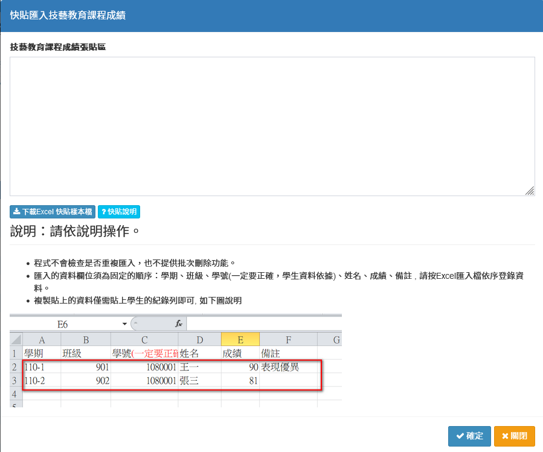

# 技藝學程成績

## 輸入技藝學程成績

.png>)

1. 選&#x64C7;**「學期」**、**「班級」**。
2. 按&#x4E0B;**「編輯」**，可個別輸入學生成績。
3. 輸入學&#x751F;**「學期分數」**、**「備註」**&#x5F8C;，按&#x4E0B;**「存檔」**。
4. 點&#x64CA;**「快貼成績」**&#x53EF;進行批次匯入大量學生，請參閱快貼說明。
5. 點&#x64CA;**「下載選擇學期成績紀錄」**，可下載技藝教育課程成績紀錄。（僅列出已輸入成績的學生）


* 「快貼成績」匯入的資料欄位須為固定的順序：學期、班級、學號(一定要正確，學生資料依據)、姓名、成績、備註 ，請按Excel匯入檔依序登錄資料。
* 可批次匯入不同班級學生之技藝課程成績。
* 程式**不會檢查是否重複匯入**，也**不提供批次刪除功能**。


## 技藝學程成績紀錄

1. 選&#x64C7;**「學期」**、**「班級」**。&#x20;
2. 點&#x9078;**「學生」**，該生成績紀錄顯示於標示處。
3. 點&#x64CA;**「列印(學生姓名)」**&#x53EF;列印學生個人技藝成績紀錄。
4. 點&#x64CA;**「列印全班」**&#x53EF;列印該班級全班技藝成績紀錄。

