# 學生資料管理

## 學生資料

### 基本資料

> 此為學生重要個人資料，請妥善管理、維護。

.png>)

1. 選&#x64C7;**「學期」**、**「班級」**、**「學生姓名」**。
2. 編&#x8F2F;**「學生基本資料」**。
3. 按&#x4E0B;**「上傳照片」**，可上傳學生照片，亦&#x53EF;**「刪除」**、**「旋轉」**&#x7167;片，大量上傳請至 [學生資料>批次上傳學生照片](sheng-liao-guan-li.md#pi-ci-shang-chuan-xue-sheng-zhao-pian) 操作。
4. 勾選學&#x751F;**「身分別」**，提供標準身分別、校訂身分別，編輯身分別請至 [身分管理>學生身分別-子類別及選項管理](sheng-liao-guan-li.md#shen-fen-bie-zi-lei-bie-xuan-xiang-guan-li)。
5. 選&#x64C7;**「原住民資料」**：原住民族別、原住民身分別、通過原住民族語認證。
6. 選&#x64C7;**「學生狀況」**：家庭狀況、父母現況、學習型態。
7. 編修完畢，按&#x4E0B;**「儲存」**，並可勾選「自動跳下一位」。


欲開放導師編修學生基本資料，請至 [參數設定 ](sheng-liao-guan-li.md#can-shu-she-ding)調整，可設定**部分開放**。


### 父母監護人資料

1. 選取 **「學期選單」** 及 **「班級選單」** 可以切換成不同學期的班級。
2. 點選 **「學生列表」** 可以切換不同的學生。
3. **「父母親及監護人資料編輯區」** 編修該生的父母親及監護人資料。
4. 點選 **「同生父」** 或 **「同生母」** 按鈕，可以複製父或母親資料到監護人資料區，但部分欄位仍需手動輸入。
5. 可勾&#x9078;**「自動跳下一位」**，系統會在儲存後跳下一號學生，接著 **「儲存」** 異動的資料。

### 兄弟姊妹資料

1. 選取 **「學期選單」** 及 **「班級選單」** 可以切換成不同學期的班級。
2. 點選 **「學生列表」** 可以切換不同的學生。
3. 點選 **「新增資料」** 按鈕，會跳出 **「編修兄弟姐妹資料」** 對話框。
4. 在 **「編修兄弟姐妹資料」** 對話框，填寫兄弟姊妹資料，並按下 **「確定」** 按鈕，可以新增兄弟姊妹資料。
5. 點選 **「刪除」** 按鈕，可以刪除該筆兄弟姊妹資料；點選 **「修改」** 按鈕，會跳出 **「編修兄弟姐妹資料」** 視窗，修改兄弟姊妹資料，並按下 **「確定」** 按鈕，可以修改該筆兄弟姊妹資料。

### 補充資料

1. 選取 **「學期選單」** 及 **「班級選單」** 可以切換成不同學期的班級。
2. 點選 **「學生列表」** 可以切換不同的學生。
3. 點&#x9078;**「項目管理與填報情形」**&#x53EF;新增或編修填報項目（如下一圖示）。
4. 點&#x9078;**「編輯」**、**「刪除」**&#x53EF;編修填寫內容。
5. 填寫內容呈現在標示處。

1. 點&#x9078;**「新增項目」**，新增一項學生補充資料項目，例如：更名紀錄。
2. 點&#x9078;**「編輯」**、**「刪除」**、**「檢視」**，可編修、查看項目內容。
3. 點&#x9078;**「編輯」**&#x5F8C;有個彈出編修視窗，可輸&#x5165;**「項目名稱」**、**「填寫說明」**、**「導師可否填報」**。
4. 按&#x4E0B;**「確定」**，儲存編修內容。

### 資料整班編修

> 提供一次編修整班相同資料欄位。

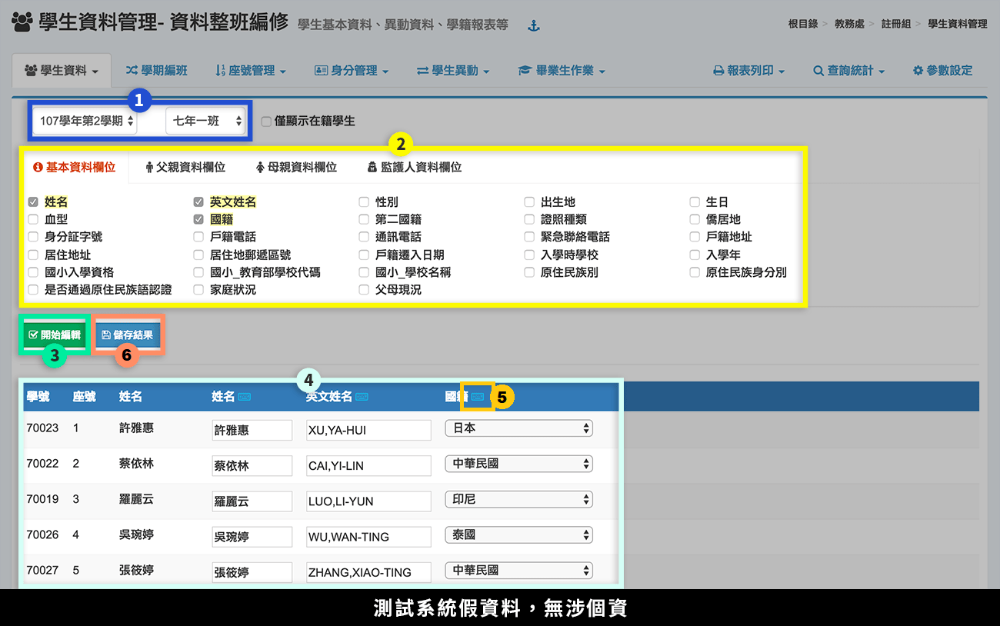

1. 選取 **「學期選單」** 及 **「班級選單」** 可以切換成不同學期的班級。
2. 選擇要編修&#x7684;**「資料欄位」**。
3. 按&#x4E0B;**「開始編輯」**。
4. 標示處可編修整班學生資料。
5. 按下鍵盤圖示，可使用欄位快貼功能。
6. 按&#x4E0B;**「儲存結果」**，完成本次編修。

### 匯入新生資料


* 操作此步驟前，請先至 [學期初設定](qi-chu-ding.md)，完成班級設定。
* 若是新學年度的第一學期，請先到 [學期編班](sheng-liao-guan-li.md#xue-qi-bian-ban-1) 將學生升級後，再匯入新生。
* 新手操作，請參考 [學期初設定大補帖](../chang-cao-zuo-liu-cheng-jiao/qi-chu-ding-da-tie.md) 教學。


1. 點擊超連結可下載 Excel 格式**範例檔**，請依照檔案格式填入資料，並保留第一列標題。本模組只能建立學生基本資料，其他如學生戶口資料等，需至 [學生基本資料](sheng-liao-guan-li.md#ji-ben-zi-liao) 建立。
2. 匯入新生資料前，請輸入**入學年**，並確認是否有設定**班級**。
3. 按&#x4E0B;**「選擇檔案」**&#x6309;鈕，並選擇編輯好之新生 Excel 格式資料。
4. 勾&#x9078;**「檢查身分證號」**，系統會驗證上傳資料中的身分證號格式是否正確。按&#x4E0B;**「檢查上傳檔案」**&#x6309;鈕，系統會將學生資料顯示在下方。
5. 如標示處出現紅色底，表示匯入資料格式錯誤，且無法點擊「批次建立資料」，請修正再操作一次。


若新生有外籍生或僑生，且尚未取得本國國籍，可將這些學生另外單獨匯入，並**不要勾選**「檢查身分證號」。（其他本國籍學生先匯入並檢查身分證號後，再匯入外籍生）


1. 匯入檔資料格式正確後，即可點&#x64CA;**「批次建立資料」**。
2. 若有錯誤的新生匯入，可按&#x4E0B;**「刪除新生資料」**，會彈出編修視窗。
3. 若學生已有成績紀錄，則無法刪除學籍。
4. 無成績紀錄的學生，可勾選後刪除。
5. 按&#x4E0B;**「刪除選取學生」**，將刪除學生學籍。

### 批次上傳學生照片

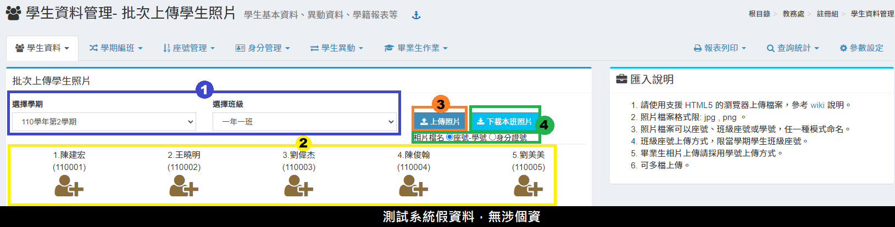

1. 選&#x53D6;**「學期選單」**&#x53CA;**「班級選單」**&#x53EF;以切換成不同學期的班級。
2. 班級學生照片一覽表，想要刪除已上傳照片，可點選照片&#x7684;**「X」**&#x6309;鈕。
3. 點&#x9078;**「上傳照片」**&#x6309;鈕，會跳出 **「上傳學生照片」**&#x8996;窗，如下圖。
4. 可點選相片檔名呈現格式，並點&#x64CA;**「下載本班照片」**&#x5373;可下載該班級學生照片。

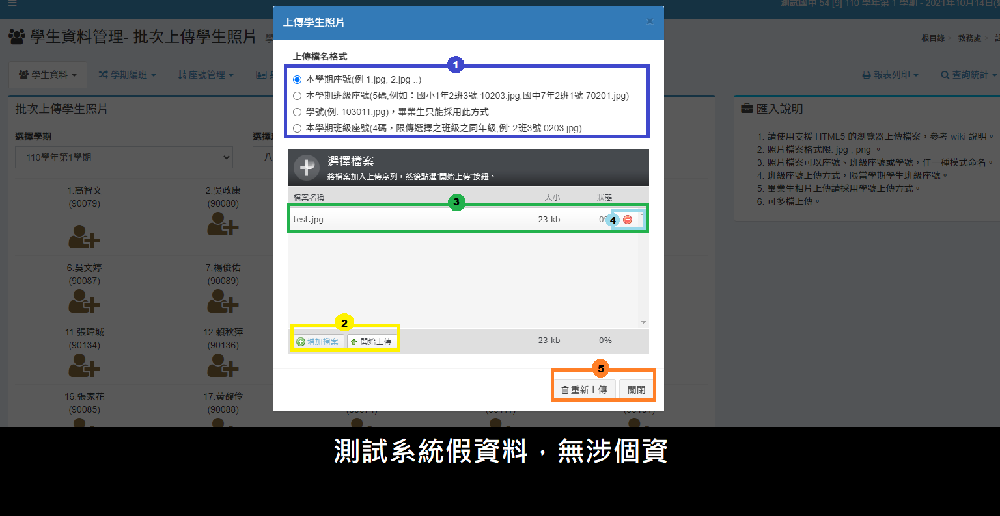

1. 批次上傳的照片檔，請依規定方式命名：本學期座號、本學期班級座號、學號、本學期班級座號（限同年級），照片格式限制為 jpg 及 png。
2. 點&#x9078;**「增加檔案」**&#x6309;鈕後，從跳出的視窗選取要上傳的照片檔，將要上傳檔案增加到上傳序列中。點&#x9078;**「開始上傳」**&#x6309;鈕後，&#x5C07;**「上傳序列」**&#x5217;表中的檔案上傳到系統資料庫。
3. 「上傳序列」列表，顯示目前已經選取的檔案。
4. 點&#x9078;**「-」**&#x6309;鈕，可將已選取的檔案從列表中刪除。
5. 按&#x4E0B;**「重新上傳」** 按鈕，可直接**清空**「上傳序列」列表中的所有檔案。點&#x9078;**「關閉」**&#x6309;鈕，離開編修視窗。

### 姓名譯音轉換

1. 選&#x53D6;**「班級選單」**&#x53EF;以切換班級。
2. 可設定全&#x73ED;**「拼音模式」**：漢語拼音、Wade-Giles 拼音、通用拼音、國音二式。
3. 可個別設定學&#x751F;**「拼音模式」**：漢語拼音、Wade-Giles 拼音、通用拼音、國音二式。
4. 可選擇**多音字**的讀音。
5. 選&#x64C7;**「編寫格式」**：護照格式、護照格式無 - 、護照格式 western、common format。
6. **「儲存所有異動」**，會將姓名英譯欄位資料，**全部寫入**系統資料庫中。
7. 若只要儲存部分學生的異動資料，可點選標示處&#x7684;**「儲存」**&#x5716;示。該區塊會依據目前所選取的「拼音模式」、「編寫格式」顯示譯音轉換結果，若譯音結果「目前姓名譯音」不同，會以黃色背景進行標記。
8. **「目前姓名譯音」** 區塊，顯示目前資料庫中該班學生的譯音資料。

## 學期編班

### 學期編班


若是新學年度第一學期，請先操作此步驟，將學生升級後，再[「匯入新生資料」](sheng-liao-guan-li.md#hui-ru-xin-sheng-zi-liao)。





1. 按&#x4E0B;**「複製上學期學生編班資料」**&#x5C07;學生從舊學期複製至新學期。若是新學年度第一學期，則會將學生的年級升級。
2. 按下 **「編班狀況」** 按鈕，可以檢視本學期的「學生人數統計表」，並提供列印功能。
3. 按下 **「編修」** 按鈕，可以進行同年級內學生的編班異動。 （參見下一頁籤說明）
4. 另可批次匯入編班資料，按&#x4E0B;**「本學期編班資料匯入」**，下載系統提供的範例黨，編修完成後上傳即可。




1. 點選 **「調整班級」** ，選擇要調整學生的班級。
2. 在該班&#x7D1A;**「勾選」**&#x8981;調整班級的學生。
3. 點選 **「調動的新班級」**。
4. 按下 **「立即移動」** 按鈕，可以將勾選的學生調到新班級。


如果是學期中轉班，已經有階段成績，請於轉班後於成績綜合管理之定期評量項下之選單內選擇"[階段成績轉班](cheng-he-guan-li.md#jie-duan-cheng-ji-zhuan-ban)"功能將學生轉班前之成績搬移到新班級成績。




### 亂數編班



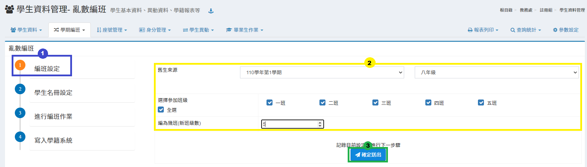

1. 點&#x64CA;**「編班設定」**。
2. 選&#x64C7;**「學期」**、**「年級」**、**「參加班級」**，輸&#x5165;**「新班級數」**。
3. 按&#x4E0B;**「確認送出」**，產生參與編班學生名冊設定檔如下圖。

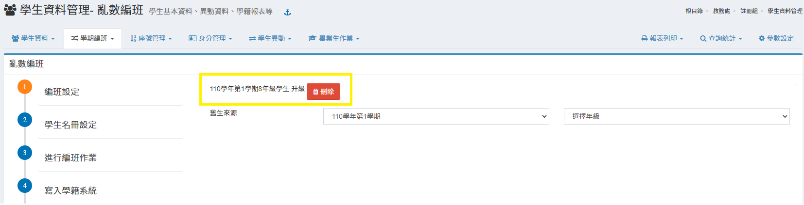



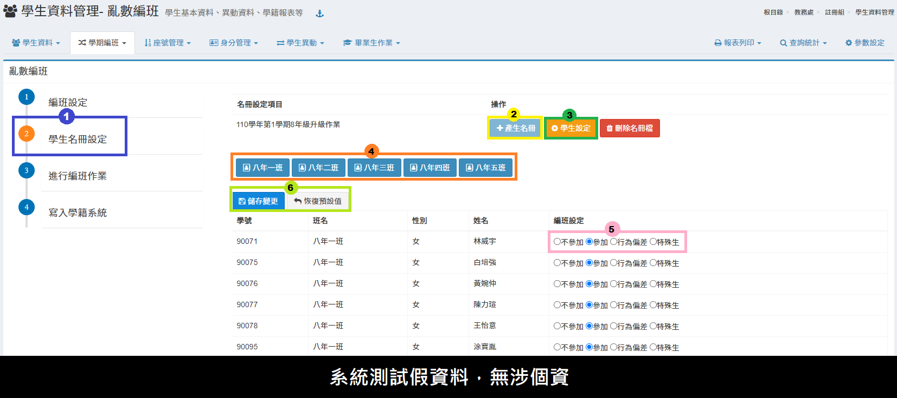

1. 按&#x4E0B;**「學生名冊設定」**。
2. 選擇欲亂數編班年級學生名冊設定檔，按下「**產生名冊**」，學生名冊將於下方顯示。
3. 點擊「**學生設定**」。
4. 點&#x64CA;**「班級」**，學生名冊將顯示於下方處。
5. 編班設定可個別設定「**不參加、參加、行為偏差、特殊生」**&#x7DE8;班之學生。狀態預設值為參加。
6. 按&#x4E0B;**「儲存變更」**&#x5373;修改學生狀態，「恢復預設值」可一鍵取消狀態變更。一



一.**進行編班作業**

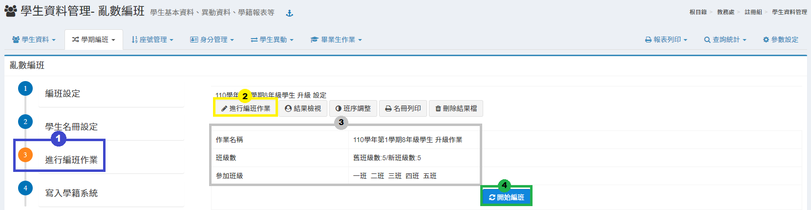

1. 按下左方列&#x8868;**「進行編班作業」**。
2. 點&#x64CA;**「進行編班作業」**。
3. 亂數編班資訊顯示如標示處。
4. 點&#x64CA;**「開始編班」**&#x6309;下確認後即完成亂數編班。

二.**結果檢視**

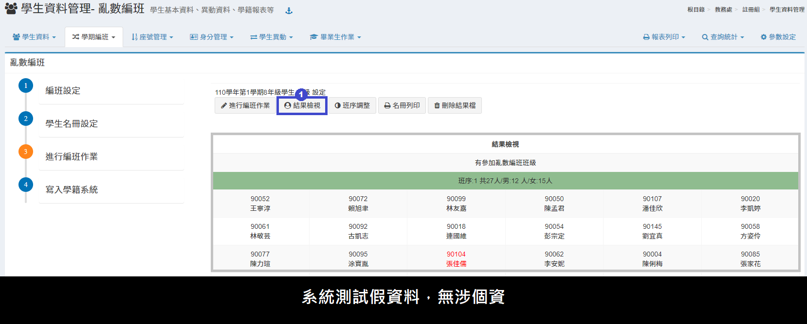

1. 點&#x64CA;**「結果檢視」**，亂數編班結果顯示於標示處。
2. 可查&#x770B;**「未參加編班」**、**「有參加且完成編班之班級學生名單」**。

三.**班序調整**

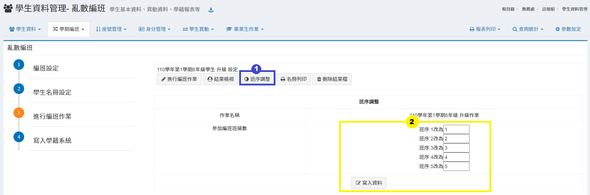

1. 按&#x4E0B;**「班序調整」**。
2. 可變更班序，並按&#x4E0B;**「寫入資料」**。

四.列印名冊

1. 按&#x4E0B;**「列印名冊」**&#x6309;鈕，以開新頁面方式列印編班名冊。




* 請再次確認編班資料，以及寫入之學期、年級，寫入後便無法回復。


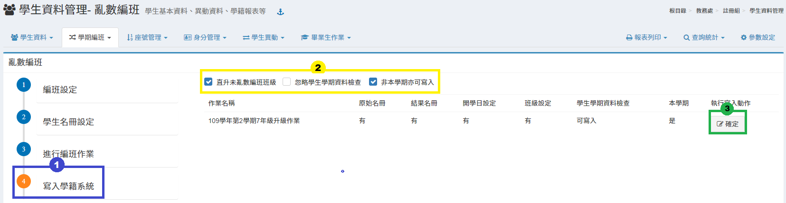

1. 按&#x4E0B;**「寫入學籍系統」**。
2. 勾選寫入檢查條件。
3. 確認資料無誤，於執行寫入動作按&#x4E0B;**「確定」**&#x5373;寫入編班資料。



### S 型編班


* 請確認畢業生已完成[「畢業轉出」](sheng-liao-guan-li.md#bi-ye-zhuan-chu)。
* 請確認已將學生升級：[「學期編班 > 複製上學期學生編班資料」](sheng-liao-guan-li.md#xue-qi-bian-ban)。（系統時間需於新學期時間範圍才能點擊此功能按鈕）



* 若欲於第二學期先行產生編班檔，可先不進行上述兩步驟，即可匯出編班檔案，但系統不允許未升級學生即操作寫入編班資料。




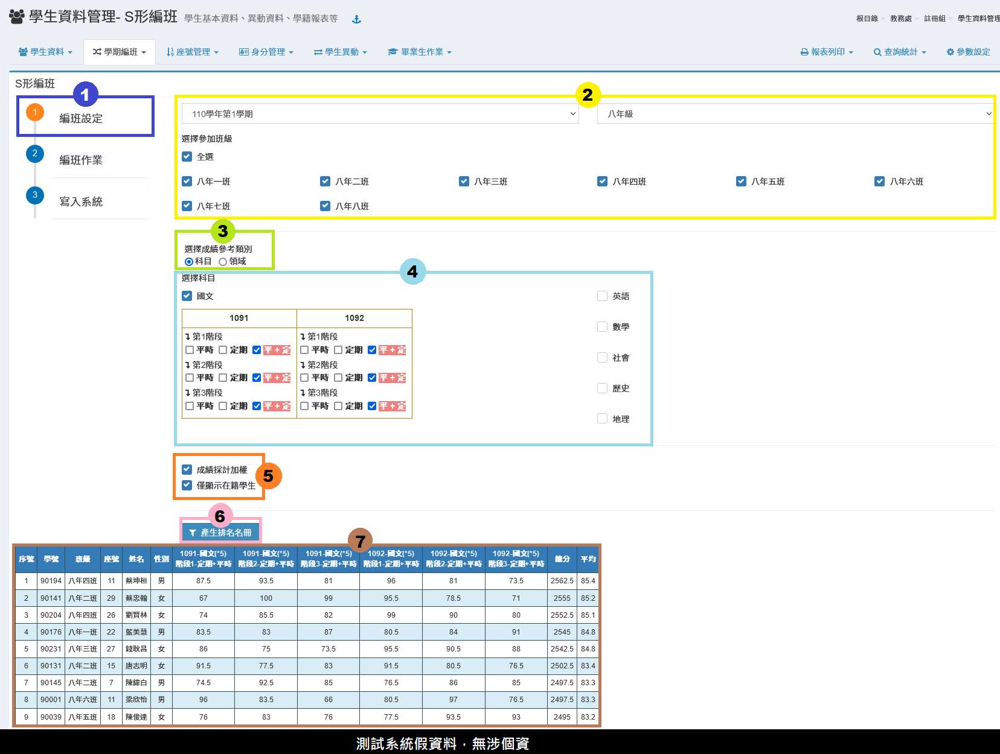

1. 點&#x64CA;**「編班設定」**。
2. 選&#x64C7;**「學期、年級、參加班級」**（不參加班級如：藝才班、特教班等）。
3. 選&#x64C7;**「成績參考類別」**：科目或領域（如選擇領域則以學期成績計算）
4. 選&#x64C7;**「計算科目、成績」**、如參考類別選擇領域則選擇「領域、學期」，如下圖。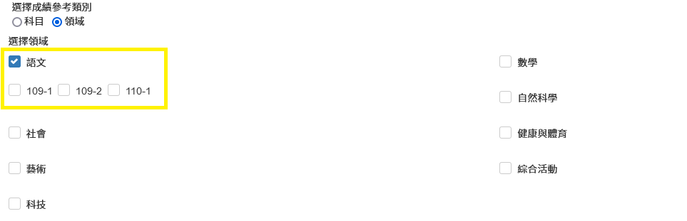
5. 勾&#x9078;**「是否採計加權、是否僅顯示在籍生」**。
6. 按&#x4E0B;**「產生名冊」**。
7. 標示處顯示參與編班學生名冊。



#### 一、學生設定

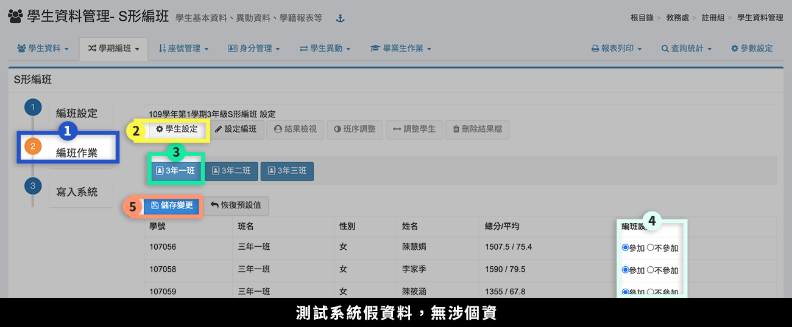

1. 按&#x4E0B;**「編班作業」**。
2. 按&#x4E0B;**「學生設定」**。
3. 選擇班級。
4. 可個別設&#x5B9A;**「不參加」**&#x7DE8;班之學生。
5. 按&#x4E0B;**「儲存變更」**。

#### 二、設定編班

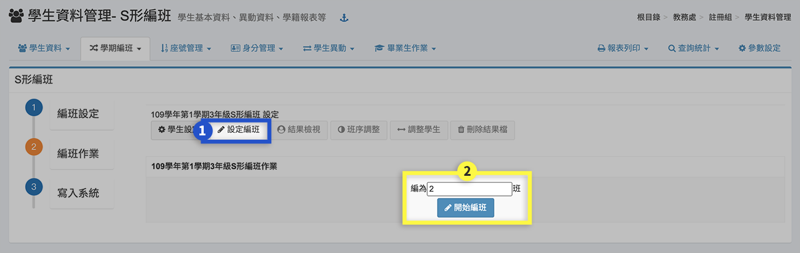

1. 按&#x4E0B;**「設定編班」**。
2. 填&#x5165;**「編班數」**&#x4E26;按&#x4E0B;**「開始編班」**。

#### 三、結果檢視

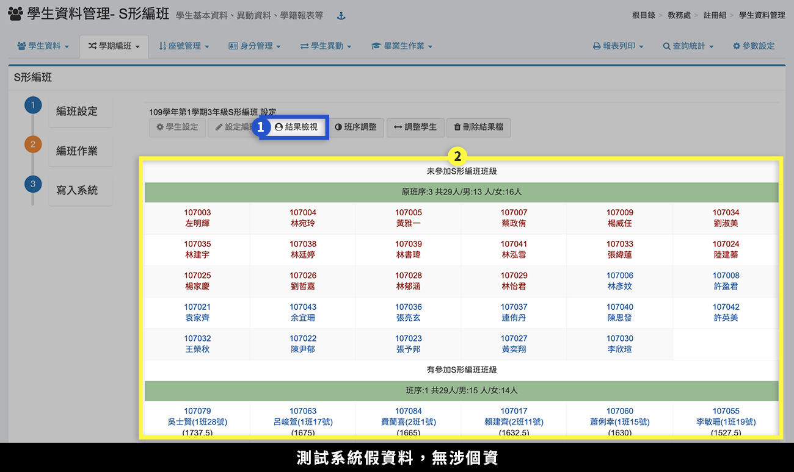

1. 按&#x4E0B;**「結果檢視」**。
2. 可查&#x770B;**「未參加編班」**、**「有參加且完成編班之班級學生名單」**。

#### 四、班序調整

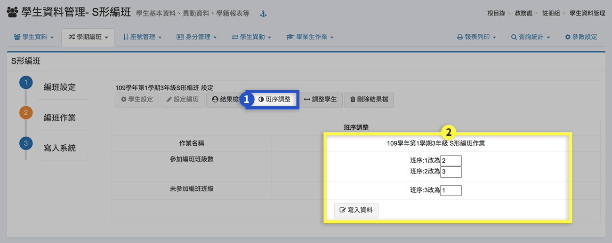

1. 按&#x4E0B;**「班序調整」**。
2. 可變更班序，並按&#x4E0B;**「寫入資料」**。

#### 五、調整學生

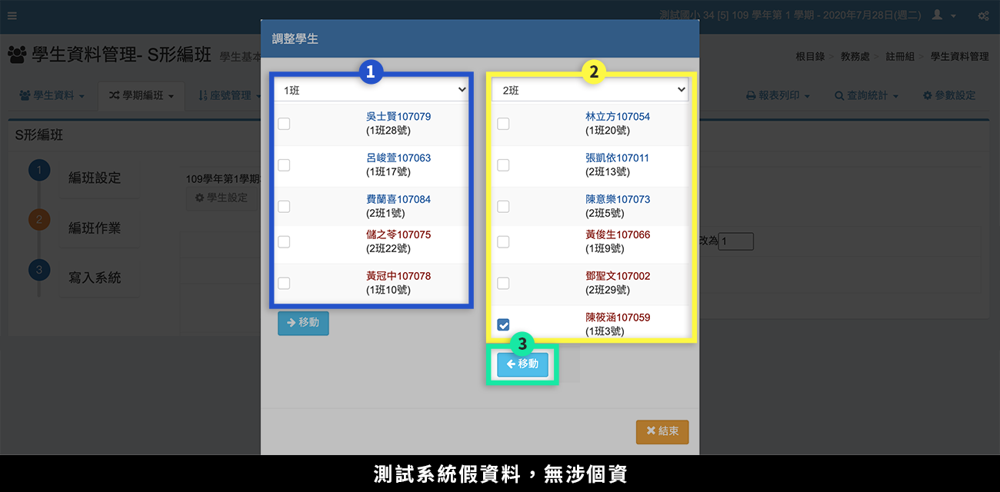

1. 選擇調整班級。
2. 勾選調整之學生。
3. 按&#x4E0B;**「移動」**。




* 寫入系統前，請務必先將學生升級。
* 請再次確認編班資料，以及寫入之學期、年級，寫入後便無法回復。


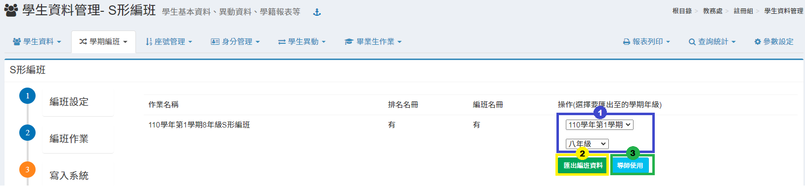

1. 選擇寫&#x5165;**「學期、年級」**。
2. 匯出學期編班資料，將檔案轉存成 CSV 格式，於[「學期編班」](sheng-liao-guan-li.md#xue-qi-bian-ban-1)模組匯入該檔案。
3. 可點&#x64CA;**「導師使用」**&#x532F;出資料，供師生檢閱。



## 座號管理

### 座號管理

> 管理學生座號資料，本模組適合於學期初時配合編班使用，期中時不建議使用，以免影響其他資料的正確性。

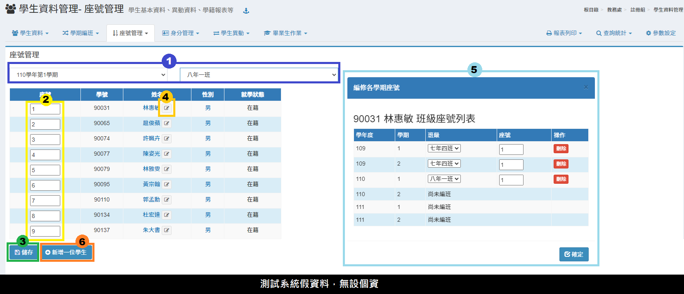

1. 選取 **「學期選單」** 及 **「班級選單」** 可以切換成不同學期的班級。
2. 在座號欄位中填入該生要變更的新座號。
3. &#x20;**「儲存」** 按鈕可將該班的學生座號儲存。
4. 點選學生姓名旁的編輯圖示，會彈出編輯視窗，如編號 5 標示處。
5. 在「編修各學期座號」視窗，可以清楚顯示該生自入學以來在學期的班級、座號，在欄位內修改資料後，按下確定即可以修改資料。點&#x64CA;**「刪除」**&#x6309;鈕即可刪除該生編班資料。
6. 點選 **「新增一位學生」** 按鈕，會跳出「新增一位學生到本班」視窗，在「輸入學生學號」欄位內填入要加入的學生學號，按下 **「查詢」** 按鈕，即可將該生加入到目前的班級，其預設座號為最後一號。

### 座號速編

> 提供整班座號快速編輯。

1. 選取 **「學期選單」** 及 **「班級選單」** 可以切換成不同學期的班級。
2. 輸入學生座號排序&#x7684;**「優先順序」**，一次最多可以選擇 5 個排序條件，例如第 1 優先條件選擇「性別-由高至低」表示男生排在前面女生排在後面，第2優先條件選擇「生日-由高至低」，表示較晚出生的的學生排在前面，較早出生的學生排在後面。
3. 點選 **「依我選擇列示」** 按鈕，可以在區塊 4 預覽排序的結果。
4. 區塊 4 列出目前所選班級的座號及基本資料列表。
5. 區塊 5 的座號欄位表示目前的座號排序狀況，也可以直接在欄位上進行座號微調。
6. 點選 **「依目前新座號更新資料」** 按鈕，表示將會依照區塊 5 的座號欄位，將學生的座號重新調整。

### 學期座號對應

1. 選擇學期。
2. 選擇對應年級。
3. 系統會列出所選年級的學生，所選學期和前一學期的班級、座號對應。

## 身分管理

### 家庭狀況管理

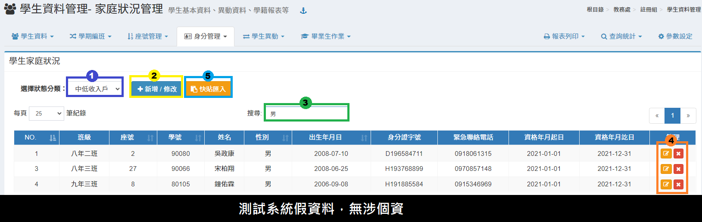

1. 選&#x64C7;**「低收入戶類別」**。
2. 按&#x4E0B;**「新增／修改」**，可新增或編輯學生家庭狀況。
3. 可在搜尋欄位輸入「班級、座號、學號、姓名、性別、出生年月日、身分證字號、緊急聯絡電話」的部分關鍵字，來查找學生資料。
4. 按&#x4E0B;**「編輯」**&#x53EF;編輯該生身分別資格年起訖日期，**「x 解除」**&#x53EF;移除該生身分別。
5. 按&#x4E0B;**「快貼匯入」**&#x53EF;一次新增多筆學生資料。請參照快貼說明操作即可。

### 原住民管理

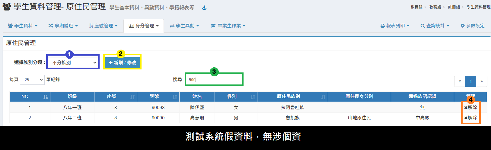

1. 選&#x64C7;**「原住民族別」**。
2. 按&#x4E0B;**「新增／修改」**。
3. 可在搜尋欄位輸入「班級、座號、學號、姓名、性別、原住民族別、原住民身分別、通過族語認證」的部分關鍵字，來查找學生資料。
4. 按&#x4E0B;**「x 解除」**&#x53EF;移除該生身分別。

### 身分別管理

1. 選&#x64C7;**「身分別」**，如：本人身障、家長身障、功勳子女......等。
2. 按&#x4E0B;**「新增學生」**。
3. 可在搜尋欄位輸入「班級、座號、學號、姓名、性別、出生年月日、身分證字號、緊急聯絡電話」的部分關鍵字，來查找學生資料。
4. 按&#x4E0B;**「x 解除」**&#x53EF;移除該生身分別。

### 身分別-子類別設定及統計



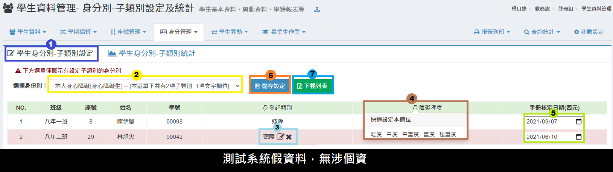

1. 選&#x64C7;**「學生身分別-子類別設定」**。
2. 選&#x53D6;**「身分別」**&#x6E05;單，可以顯示不同身分別的所有學生。
3. **滑鼠移至要編輯的欄位**，畫面會出&#x73FE;**「編輯」**&#x6216;**「刪除」**&#x6309;鈕，按下即可設定類別。
4. 點擊標題欄位&#x7684;**「手指圖示」**，可快速將所有學生**設成一致的類別**。
5. 可個別編&#x8F2F;**「手冊核定日期」**。
6. 當所有身分別子類別均已選好後，點&#x9078;**「儲存設定」**&#x6309;鈕，可以將所有異動的子類別設定儲存。
7. 點擊「下載列表」可下載學生身分別資料。


如選擇身分別無子類別及其選項，若有需增加子類別請到「[身分別-子類別選項管理](sheng-liao-guan-li.md#shen-fen-bie-zi-lei-bie-xuan-xiang-guan-li)」進行設定。





1. 選&#x64C7;**「學生身分別-子類別統計」**。
2. 選&#x64C7;**「身分別清單」**。
3. 勾&#x9078;**「統計項目」**。
4. 標示處呈現統計結果。
5. 按下**眼睛**圖示，可查看學生名單。



### 身分別-子類別選項管理

> 可編輯預設身分別的子類別項目，以及自訂校端身分別與子類別項目。

1. 標示處&#x70BA;**「身分別」**。
2. 標示處&#x70BA;**「子類別」**，當點擊到時，會呈現**橘色**，表示可操作編輯（第 4 步驟）。
3. 標示處&#x70BA;**「子類別下的選項」**（必須設定到此選項，才能進行身分子類別的註記）。
4. 點擊樹狀圖中要編輯的項目（呈現橘色），可在標示&#x8655;**「新增、編輯、刪除子類別或項目」**。
5. 點擊樹狀圖中要編輯的項目（呈現橘色），可針對該項目下的項&#x76EE;**「調整排序」**。按&#x4E0B;**「展開**、**收起」**，可調整樹狀圖呈現狀態。按&#x4E0B;**「篩選」**，可選擇要呈現的身分別。
6. 點選工具列上&#x7684;**「說明」**&#x6309;鈕，右方會顯示樹狀結構的說明，提供參考。

### 學生身分別清冊

> 可自由勾選身分別項目，輸出學生身分別清冊。

1. 勾選要輸出清冊&#x7684;**「身分別項目」**。
2. 可選&#x64C7;**「取消選取」**、**「全部選取」**、**「反向選取」**。
3. 選&#x64C7;**「資料篩選方式」**：OR 為勾選身分別的聯集（有一身分別符合即列出），AND 為勾選身分別的交集（必須符合所有勾選身分別者才列出）。
4. 按&#x4E0B;**「查詢」**。
5. **查詢結果**顯示在標示處。
6. 按&#x4E0B;**「匯出 Excel」**&#x532F;出清冊。

### 實驗教育機構團體學生設定(台中限定)

> 此模組功能在標記寄籍生隸屬實驗教育機構、團體，並提供臺中市數位學生證系統介接雲端校務系統時，判別實驗教育機構、團體學生使用。

<figure>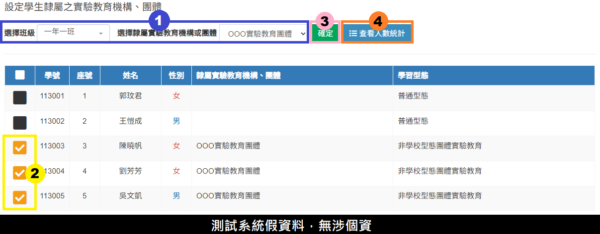<figcaption></figcaption></figure>

1. 選&#x64C7;**「班級」**、**「實驗教育機構/團體」**。
2. 勾&#x9078;**「學生」**。
3. 點&#x64CA;**「確定」**&#x5132;存資料。
4. &#x53EF;**「查看人數統計」**。


* 使用前提：\
  1.如需新增"實驗教育機構、團體"，請與系統客服聯繫並檢附公文。\
  2.實驗教育機構、團體學生學籍資料必須已經建置於雲端校務系統內。
* 請依照掛籍於貴校之實驗教育機構、團體學生名冊，設定學生隸屬學校。


## 學生異動

### 轉入



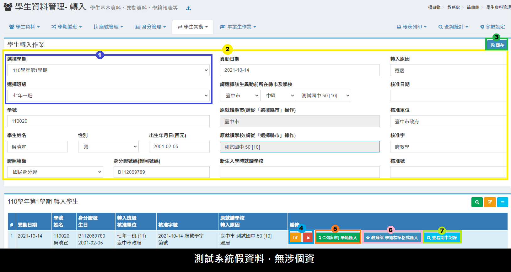

1. 選&#x53D6;**「學期選單」**、**「選擇班級」**，系統會找出該年級最後一個學號，並 +1 號作為轉入生學號。
2. 填入轉入&#x751F;**「基本資料」**，若該生原就讀學校不在選單裡，請在縣市選單選擇「其他」，即可編輯縣市、學校名稱。
3. **「儲存」**&#x8F49;入生資料，儲存後該筆資料會顯示在編輯轉入作業區的下方。
4. 在轉入列表中，按&#x4E0B;**「編輯」**&#x6216;**「刪除」**&#x5716;示，可編修／刪除該筆異動紀錄。
5. 若轉入生原就讀學校使用CS系統請點&#x9078;**「CS縣(市)學籍匯入」**，操作說明請參考下一頁籤。
6. 若轉入生原就讀學校未使用CS系統，請使&#x7528;**「教育部-學籍標準格式匯入」，**&#x8ACB;選擇符合教育部學籍交換規格標準檔案格式匯入。
7. 匯入學生學籍後，&#x53EF;**「查看期中紀錄」**。


* 目前本系統的學籍資料格式是遵照教育部頒布的 **交換規格標準 4.1**  所設計，因此外縣市轉入生所提供的 Json檔，若非 4.1 標準規格則無法匯入。
* 本系統不支援**交換規格標準 4.1** 暨以下版本，需要由校端手動補登學生的資料。
* 十二年國教新課綱實施後入學之學生，不支援使用「教育部學籍交換標準 3.0」 XML 格式匯入資料。




在轉入作業按&#x4E0B;**「CS縣(市)學籍匯入」**，會彈出下列視窗。

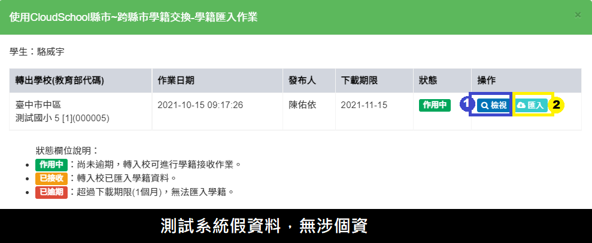

1. 按&#x4E0B;**「檢視」**，可查看學生學籍 json 檔。
2. 按&#x4E0B;**「匯入」**，將學生他校紀錄匯至本校。\
   <mark style="color:red;">※匯入時可選擇是否要匯入當學期不完整成績紀錄。如是期中轉入，可選擇不匯入</mark><mark style="color:red;">**當學期不完整成績**</mark><mark style="color:red;">（過往完整的學期成績無視此選項，一定會匯入）</mark>


若無顯示學籍資料檔案可接收，\
1\. 請確認學生在轉入作業編輯時，身分證是否輸入正確。\
2\. 請確認對方學校是否已經匯出學籍資料。




一般轉入作業流程請參考下圖，詳細作業規定因各校有所差異，請遵照各校規範。

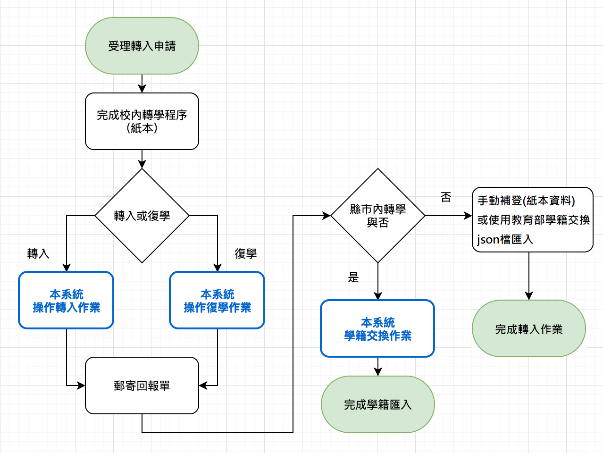



### 調出



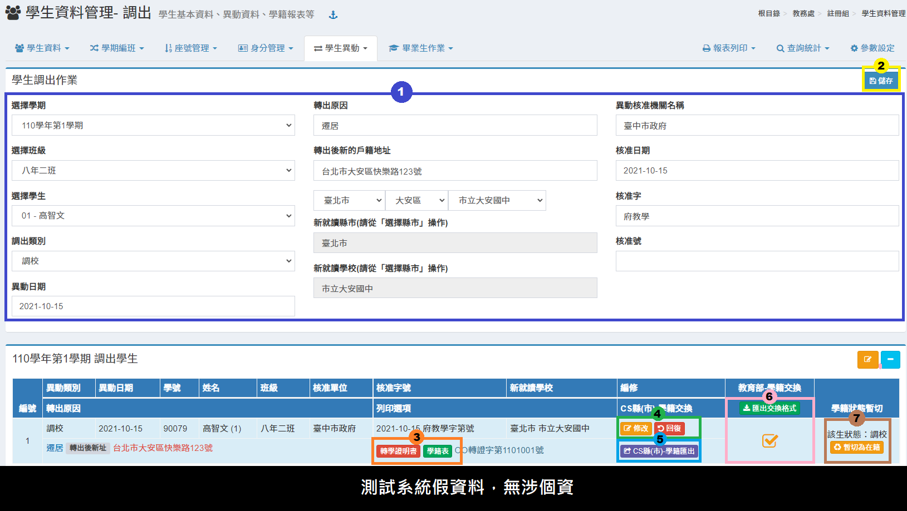

1. 填入調出&#x751F;**「基本資料」**，若該生新就讀學校不在選單裡，請在縣市選單選&#x64C7;**「其他」**，即可編輯縣市、學校名稱。
2. **「儲存」**&#x8ABF;出生資料，儲存後該筆資料會顯示在編輯調出作業區的下方。
3. 在調出列表中，可下&#x8F09;**「轉學證明書」**、**「學籍表」**。
4. 在調出列表中，&#x53EF;**「編輯」**&#x8A72;筆異動紀錄，&#x6216;**「回復」**&#x8A72;筆紀錄，即取消調出。
5. 若調出生新就讀學校縣市使用CS系統，請點&#x9078;**「CS縣(市)學籍匯出」**，操作說明請參考下一頁籤。
6. 若調出生新就讀學校未使用CS系統，請勾選並點&#x64CA;**「匯出交換格式」**，下載相符之學籍交換規格標準檔案，並傳送給對方學校註冊組。
7. 欲查看調出生在本校的任何紀錄，可按&#x4E0B;**「暫切為在籍」**，操作完畢請務&#x5FC5;**「回復為調校」**。



在調出作業按&#x4E0B;**「CS縣(市)學籍匯出」**，會彈出下列視窗。

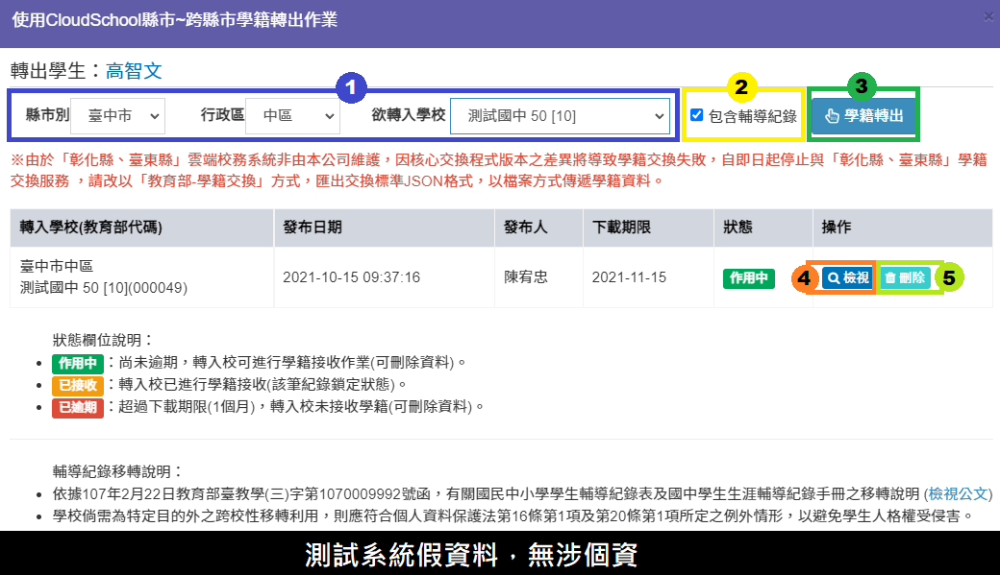

1. 選擇調出生新就讀學校區域、學校名稱。
2. 勾選是&#x5426;**「包含輔導紀錄」**。
3. 按&#x4E0B;**「學籍轉出」**。\
   <mark style="color:red;">※可選擇是否要匯出當學期成績，如遇期中轉學，學生當學期學期成績仍不完整，可不匯出。</mark>
4. 按&#x4E0B;**「檢視」**，可查看學生學籍 json 檔。
5. 在對方學校未接收學籍前，可按&#x4E0B;**「刪除」**。


如對方學校已接收學籍資料檔，學生在本校仍有資料更新，請重新操作匯出作業，然後請對方學校再接收一次。




一般調出作業流程請參考下圖，詳細作業規定因各校有所差異，請遵照各校規範。

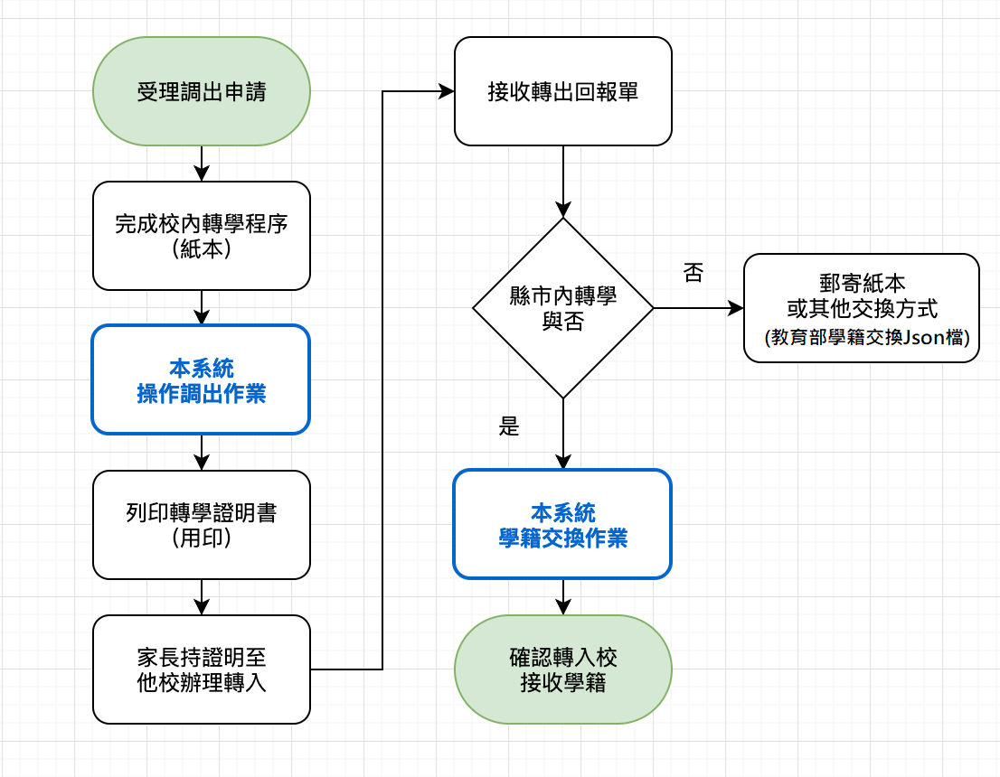



### 復學

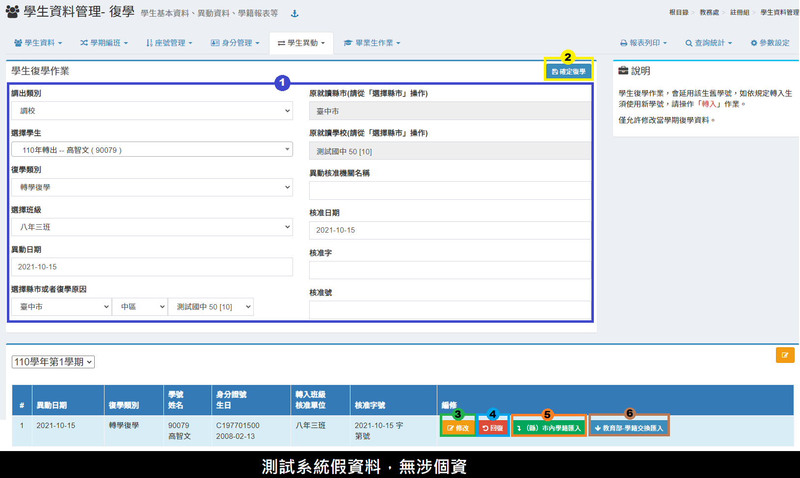

1. 填入復學&#x751F;**「基本資料」**。
2. 按&#x4E0B;**「確定復學」**，可以將曾經本校就學過的學生復學。
3. 在復學生列表中，可點&#x9078;**「修改」**&#x7DE8;輯異動紀錄。
4. 按&#x4E0B;**「回復」**&#x6309;鈕，可以取消該生的復學紀錄。
5. 若由CS縣市學校轉入的復學生，可按&#x4E0B;**「市內學籍匯入」**（對方學校須先完成調出作業，並匯出學生學籍，本校才能接收）。
6. 按&#x4E0B;**「教育部-學籍交換匯入」**&#x6309;鈕，可以上傳「XML 學籍交換格式」或「JSON學籍交換格式」檔案，匯入該生資料。


* 十二年國教新課綱實施後入學之學生，不支援使用「教育部學籍交換標準 3.0」 XML 格式匯入資料。


### 新生入學

> 依據報府核准文號，記錄新生進入本校日期及核定情形的異動紀錄。

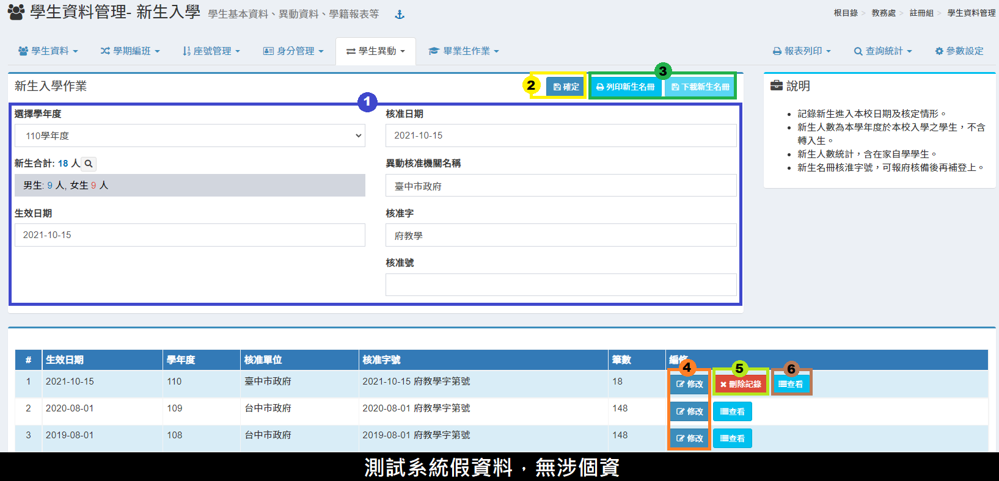

1. 填入的新生入&#x5B78;**「基本資料」**&#x6B04;位。點&#x64CA;**「放大鏡」**&#x53EF;查看新生入學名單。
2. 按&#x4E0B;**「確定」** 按鈕，可以儲存本學年度新生入學資料。
3. 按&#x4E0B;**「列印新生名冊」**，會彈出列印預覽視窗；按&#x4E0B;**「下載新生名冊」**&#x53EF;下載新生資料 Word 檔。
4. 按&#x4E0B;**「修改」**&#x6309;鈕，可在區塊 1 載入要編修的學年度（亦可直接在區塊 1 選擇要編修的年度），填入修改資料按下「確定」按鈕，可以修改該學年度核定資料。
5. 按&#x4E0B;**「刪除紀錄」**&#x6309;鈕，可以刪除該學年度核定資料。僅當學年度資料可以被刪除，其餘歷年的資料僅能修改不能刪除。
6. 按下「**查看**」按鈕，可查看新生名冊列表進行學生個別修改。


新生人數為本學年度在本校入學的學生數，也就是本校操作「匯入新生」的數量，不含轉入生。


### 畢業轉出

> 畢業生轉出記錄及核定情形。

1. 填入的畢業轉&#x51FA;**「基本資料」**&#x6B04;位。
2. 可按&#x4E0B;**「查看各班畢業生人數」**，確認人數是否正確。
3. 按&#x4E0B;**「確定」** 按鈕，可以儲存本學年度畢業轉出資料。
4. 按&#x4E0B;**「修改」**&#x6309;鈕，可在區塊 1 載入要編修的學年度（亦可直接在區塊 1 選擇要編修的年度），填入修改資料按下「確定」按鈕，可以修改該學年度核定資料。
5. 按&#x4E0B;**「刪除紀錄」**&#x6309;鈕，可以刪除該學年度核定資料。僅當學年度資料可以被刪除，其餘歷年的資料僅能修改不能刪除。

### 升降級作業

調整學生升降級作業紀錄


* 學生升降級作業只能處理當學期之學生升降級。
* 請於學期初未輸入成績前異動。


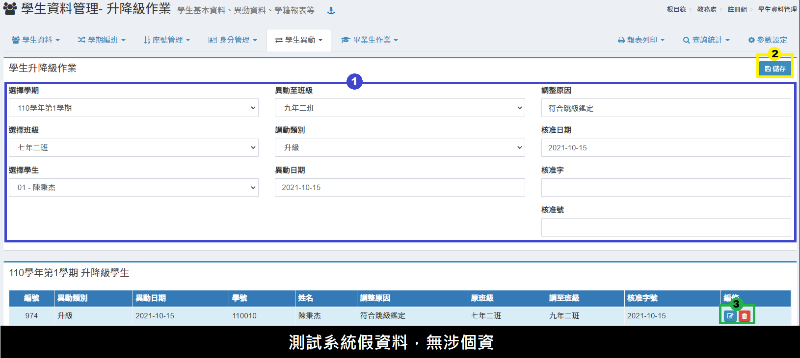

1. 選擇學生及升降級之班級並填入相關資料。
2. 按&#x4E0B;**「儲存」** 按鈕，可以儲存學生升降級資料，該筆資料顯示在作業區的下方。
3. 按&#x4E0B;**「修改」、「刪除紀錄」**&#x6309;鈕，可修改／刪除該生升降級紀錄，如刪除紀錄學生會恢復到原年級。

### 在家自學

> 設定在家自學學生。

1. 選&#x64C7;**「班級、學生」**。
2. 按&#x4E0B;**「確定在家自學」**。
3. 要將學生取消在家自學設定，可在列表中按&#x4E0B;**「移除」**。

### 轉入生復學生資料補登

> 轉入/復學生若無法匯入完整學籍，請在補登項目中補登紀錄。



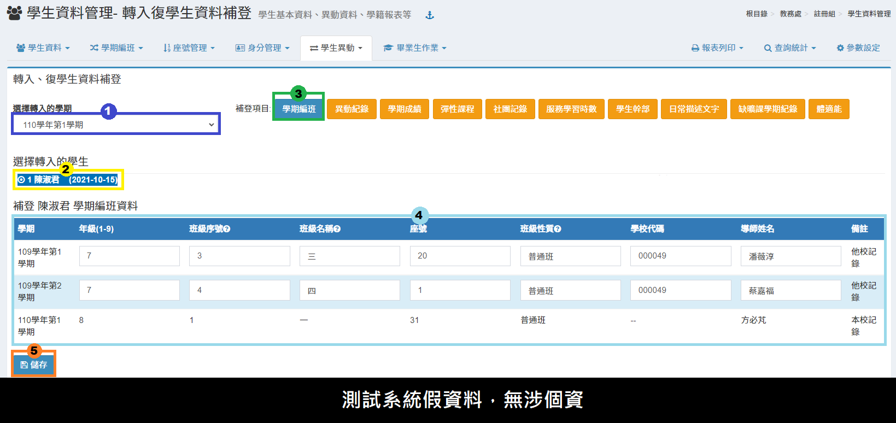

1. 選取轉入生&#x7684;**「轉入學期」**。
2. 選擇該學期要補登&#x7684;**「轉入生」**。
3. 選擇補登項&#x76EE;**「學期編班」**。
4. 在欄位內填入該轉入生在他校就讀時，各個年段的編班情形，如班級名稱、座號、導師姓名等。
5. 按&#x4E0B;**「儲存」**&#x6309;鈕，儲存補登資料。選取轉入生&#x7684;**「轉入學期」**。


若學期無編班資料(班級序號、座號)，學生匯出的學籍資料不會帶出該學期的相關資料，請務必確認其資料完整性。




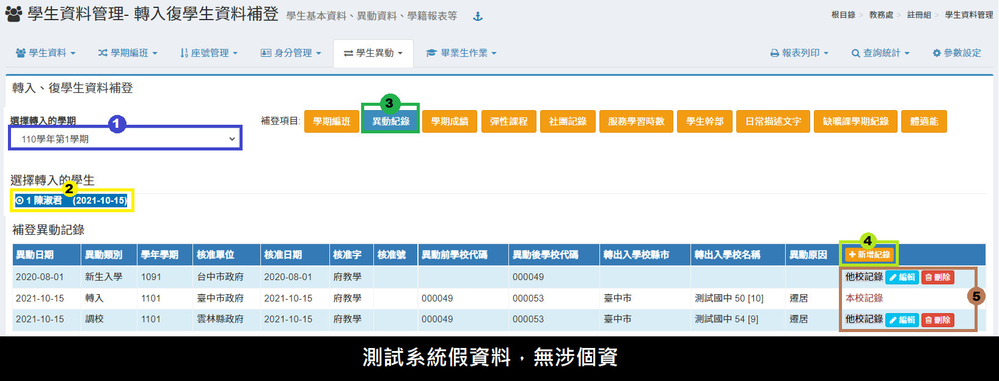

1. 選擇該學期要補登&#x7684;**「轉入生」**。
2. 選擇補登項&#x76EE;**「異動紀錄」**。
3. 按&#x4E0B;**「新增紀錄」**&#x53EF;新增異動紀錄。
4. &#x53EF;**「編輯」**、**「刪除」**&#x88DC;登的異動紀錄。



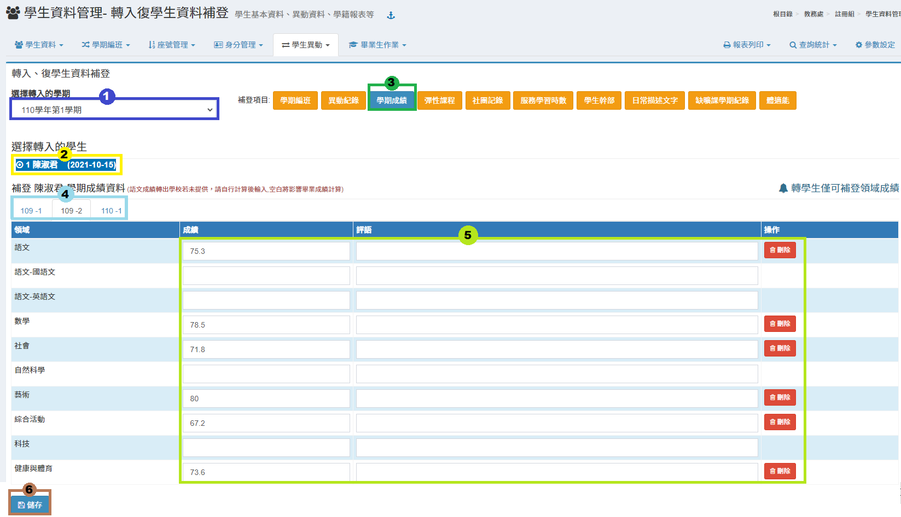

1. 選取轉入生&#x7684;**「轉入學期」**。
2. 選擇該學期要補登&#x7684;**「轉入生」**。
3. 選擇補登項&#x76EE;**「學期成績」**。
4. 選擇補登成績&#x4E4B;**「學期」**。
5. 在欄位內填入該轉入生的學期成績。
6. 按&#x4E0B;**「儲存」**，儲存補登的成績紀錄。


* 依教育部公布的學籍交換規格標準，學籍成績僅交換「領域成績」。
* 若於舊系統（SFS3）辦理轉入的學生，有出現**學籍成績錯誤**情形，是因為 SFS3 允許將轉入生成績補登於分科成績中，請依照下圖步驟刪除分科成績。若轉入生的學籍成績紀錄表成績無誤，則毋須任何操作。


1. 選取轉入生&#x7684;**「轉入學期」**。
2. 選擇該學期要補登&#x7684;**「轉入生」**。
3. 選擇補登項&#x76EE;**「學期成績」**。
4. 選擇學籍成績紀錄表中，錯誤成績&#x4E4B;**「學期」**。
5. 按&#x4E0B;**「按此顯示分科成績」**。
6. 將錯誤成&#x7E3E;**「刪除」**，並在此介面補上正確的領域成績。



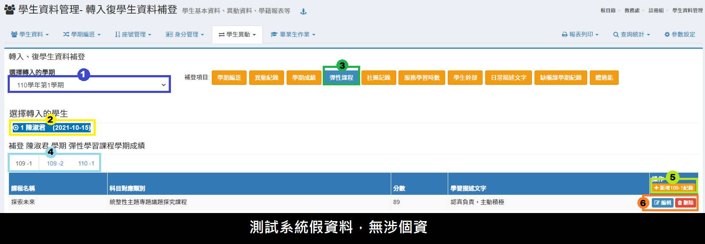

1. 選取轉入生&#x7684;**「轉入學期」**。
2. 選擇該學期要補登&#x7684;**「轉入生」**。
3. 選擇補登項&#x76EE;**「彈性課程」**。
4. 選擇補登成績&#x4E4B;**「學期」**。
5. 按&#x4E0B;**「新增紀錄」**&#x4E26;在欄位內填入該轉入生的彈性課程成績。
6. 按&#x4E0B;**「編輯」、「刪除」**，可編輯／刪除補登的彈性課程成績紀錄。




補登轉入生的社團紀錄，也可以在學務處 [學校社團管理>補登資料](../undefined/xiao-she-guan-li.md#bu-deng-zi-liao) 操作。


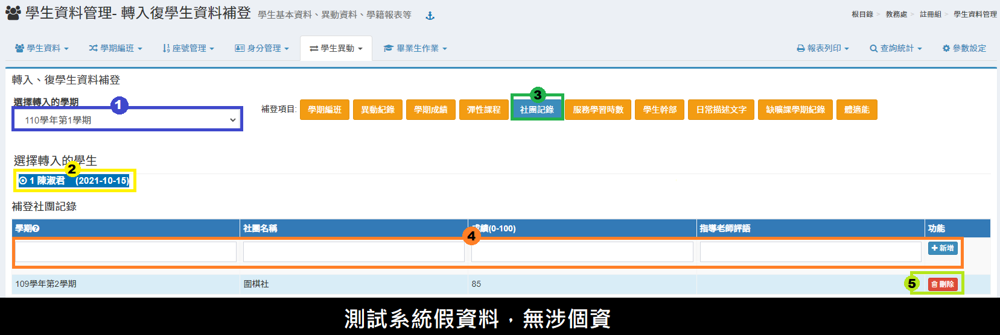

1. 選取轉入生&#x7684;**「轉入學期」**。
2. 選擇該學期要補登&#x7684;**「轉入生」**。
3. 選擇補登項&#x76EE;**「社團紀錄」**。
4. 在欄位內填入該轉入生的社團紀錄，按&#x4E0B;**「新增」**。
5. &#x53EF;**「刪除」**&#x88DC;登的社團紀錄。




補登轉入生的服務學習時數，也可以在學務處 [學生服務學習>轉學生資料補登 ](../undefined/sheng-fu.md#zhuan-xue-sheng-zi-liao-bu-deng)操作。


1. 選取轉入生&#x7684;**「轉入學期」**。
2. 選擇該學期要補登&#x7684;**「轉入生」**。
3. 選擇補登項&#x76EE;**「服務學習時數」**。
4. 在欄位內填入該轉入生的服務學習紀錄，按&#x4E0B;**「確定新增」**。
5. &#x53EF;**「刪除」**&#x88DC;登的服務學習紀錄。




補登轉入生的幹部紀錄，也可以在學務處 [學生幹部>幹部補登 ](../undefined/sheng-bu.md#gan-bu-bu-deng)操作。


1. 選取轉入生&#x7684;**「轉入學期」**。
2. 選擇該學期要補登&#x7684;**「轉入生」**。
3. 選擇補登項&#x76EE;**「學生幹部」**。
4. 在欄位內填入該轉入生的幹部紀錄，按&#x4E0B;**「新增」**。
5. &#x53EF;**「刪除」**&#x88DC;登的幹部紀錄。




1. 選取轉入生&#x7684;**「轉入學期」**。
2. 選擇該學期要補登&#x7684;**「轉入生」**。
3. 選擇補登項&#x76EE;**「日常描述文字」**。
4. 在欄位內填入該轉入生的日常描述文字，按&#x4E0B;**「儲存」**。
5. &#x53EF;**「刪除」**&#x88DC;登的日常描述文字。




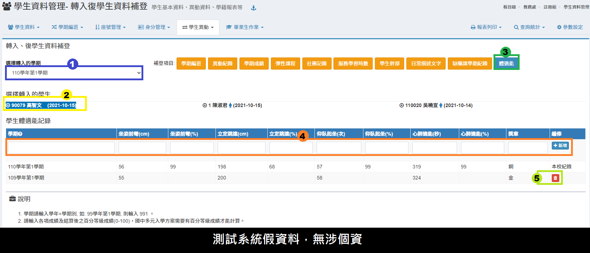

1. 選取轉入生&#x7684;**「轉入學期」**。
2. 選擇該學期要補登&#x7684;**「轉入生」**。&#x20;
3. 選擇補登項&#x76EE;**「體適能」**。&#x20;
4. 在欄位內填入該轉入生每學期各體適能項目紀錄，按&#x4E0B;**「新增」**。&#x20;
5. &#x53EF;**「刪除」**&#x88DC;登的體適能紀錄。



### 異動記錄列表

> 查詢及列印所有異動紀錄。

.png>)

1. 勾選要查詢&#x7684;**「異動類別」**。
2. 選擇查&#x8A62;**「日期之起訖」**&#x53CA;**「年級」**。
3. 勾選查詢條件及顯示方式
4. 按&#x4E0B;**「查詢」**&#x6309;鈕。
5. 區塊 5 顯示查詢結果。
6. &#x53EF;**「列印」**&#x6216;**「儲存」**&#x67E5;詢的異動紀錄。

### 異動統計表

> 列出選擇學期所有異動報表。

1. 選擇查詢&#x7684;**「學期」**。
2. 列出所選學期的所有異動資料統計表。
3. 按&#x4E0B;**「列印」**&#x6309;鈕，列印異動統計資料。

## 畢業生作業

### 畢業生一覽表




要開啟或關閉舊學年畢業生作業，請至 [參數設定 ](sheng-liao-guan-li.md#can-shu-she-ding)操作。


.png>)

.png>)

1. 在尚未操作畢業生的學期，按&#x4E0B;**「同步化應屆學生資料」**。
2. 按&#x4E0B;**「編修升學學校」**&#x6309;鈕，切到編修升學學校頁面，參考下一頁籤。
3. 按&#x4E0B;**「設定證書字號」**&#x6309;鈕，切換到畢業書字號設定頁面，參考第三頁籤。
4. 按&#x4E0B;**「名冊列印」**&#x6309;鈕，顯示列印畢業生名冊視窗，參考第四頁籤。
5. 按&#x4E0B;**「匯出EXCEL檔」**&#x6309;鈕，即可匯出畢業證書列印用 CSV 檔案。（印製畢業證書用）
6. 按&#x4E0B;**「 匯出資料至升學國中」**&#x6309;鈕，即可匯出提供學區內國中新生編班用 CSV 檔案。（供學區國中新生編班匯入用）
7. 標示處顯示各個學年度畢(修)業學生人數統計。



在畢業生一覽表頁面，按&#x4E0B;**「編修升學學校」**，會跳至下方頁面。

1.  按&#x4E0B;**「編修升學學校」**&#x6309;鈕，會彈出左下視窗。

    1-1. 輸入升學國中名稱，並以逗號隔開（不需空格）。\
    1-2. 按&#x4E0B;**「確定」**，儲存升學學校名稱。
2.  按&#x4E0B;**「調整升學學校」**，可針對各班學生狀況進行編修。

    2-1. 選擇班級與升學學校。（請留意一次僅能設定同班級學生，若切換班級，則不會儲存上一班級選取的學生）\
    2-2. 勾選該班學生。\
    2-3. 按&#x4E0B;**「確定」**，儲存學生升學學校設定。
3. 按&#x4E0B;**「全部預設升學學校」**，可將全年級學生設定至一樣的升學學校。



在畢業生一覽表頁面，按&#x4E0B;**「設定證書字號」**，會跳至下方頁面。

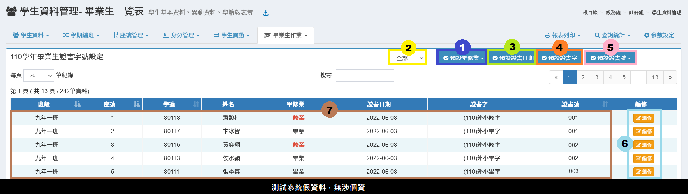

1. 按&#x4E0B;**「預設畢修業」** 選單，可以選&#x64C7;**「全部設為畢業」**、**「全部設為修業」**&#x6216;**「清除畢修業設定」**。
2. 預設畢業證書設定前，可&#x4F9D;**「畢業」**、**「修業」**、**「全部」**&#x7BE9;選名單後再進行設定。<mark style="color:red;">\*學資網Q2檢核重點</mark>
3. 按&#x4E0B;**「預設證書日期」**&#x6309;鈕，在快顯示視窗中，可以設定全部應屆畢業生的證書日期。<mark style="color:red;">\*學資網Q2檢核重點</mark>
4. 按&#x4E0B;**「預設證書字」**&#x6309;鈕，在快顯示視窗中，可以設定全部應屆畢業生的證書字。
5. 按&#x4E0B;**「預設證書號」**&#x9078;單，可以選&#x64C7;**「依學號排序設定」**&#x6216;**「依班級座號排序設定」**，決定證書流水號的排序方式。
6. 按&#x4E0B;**「編修」**&#x6309;鈕，在快顯示視窗中，可以針對個別學生設定其畢業證書相關屬性。
7. 標示處顯示該學年度應屆畢業生證書字號設定狀況。



在畢業生一覽表頁面，按&#x4E0B;**「名冊列印」**，會彈出下方視窗。

.png>)

1. 可以依照升學學校，選擇「**班級**」、「**升學學校**」，列印畢業生名冊給學區國中。
2. 可以列印或下載給教育局的畢業生名冊。
3. 可以列印畢業生名冊及修業生名冊。



在畢業生一覽表頁面，按&#x4E0B;**「匯出資料至升學國中」**，會彈出下方視窗。

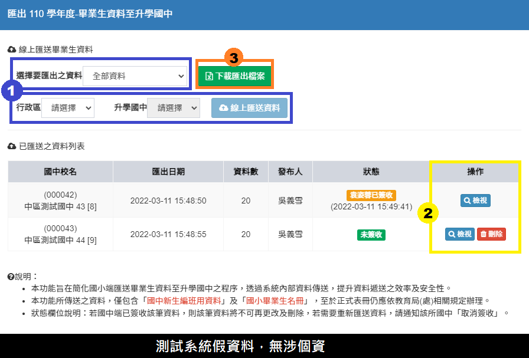

1. 選&#x64C7;**「要匯出之資料」**，並選&#x64C7;**「行政區、升學國中」**，點&#x64CA;**「線上匯送資料」。**
2. 顯示已匯送之資料。可進&#x884C;**「檢視」**&#x6216;**「刪除」**，如升學學校已簽收，則不可刪除。
3. 點&#x64CA;**「下載匯出檔案」**，可下載匯出之學生升學名冊。



### 學籍成績結算

.png>)

1. 選&#x64C7;**「學期」**、**「班級」**。
2. 選擇成績結算方式「**學習領域算術平均**」、「**學分式加權平均**」。
3. 勾&#x9078;**「顯示名次及加權」**&#x9078;項，可在學籍成績一覽表中顯示名次及加權。
4. 標示處顯示所選班級的畢業成績。
5. 按&#x4E0B;**「列印」**&#x6309;鈕，可以列印所選班級的畢業成績。亦可按「**下載**」按鈕，下載班級／全年級學籍成績結算檔案。

### 畢業條件篩選

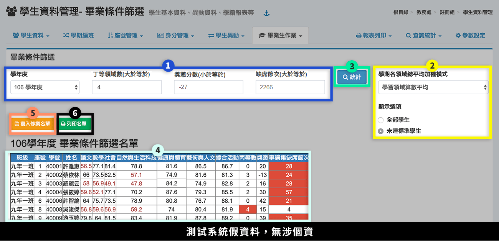

1.  選擇要篩選之\
    &#xNAN;**「學年度」**：本功能只提供計算最近之三學年度，如果沒有出現目前之學年度，請於 [畢業生一覽表](sheng-liao-guan-li.md#bi-ye-sheng-yi-lan-biao) 同步化應屆學生資料，將學生名單匯入畢業生資料。

    **「丁等領域數」**：參考可畢業之最低丙等領域數，如四領域達丁等不達畢業條件，就輸4。\
    &#xNAN;**「獎懲分數」**：可畢業之獎懲最低分數，如三大過為 -27分不達畢業條件，則輸入 -27。\
    &#xNAN;**「缺席節次」**：可畢業之缺勤最多節次。
2. 選&#x64C7;**「領域分數計算方式」**，以&#x53CA;**「顯示選項」**。
3. 按&#x4E0B;**「統計」**&#x6309;鈕，系統會開始計算
4. 標示處顯示統計結果。
5. 可將篩選出未達畢業條件之學&#x751F;**「寫入修業名單」**。
6. 按&#x4E0B;**「列印名單」**，列印篩選結果。

### 修業建議(預警)名單

.png>)

1. 選擇「**學年度學期**」、「**年級**」，以及要統計&#x7684;**「學期」**，本功能只提供計算目前在校學生。
2. 選&#x64C7;**「領域分數計算方式」**，以及要篩選&#x4E4B;**「不及格領域分數及項次」**。
3. 按&#x4E0B;**「確定」**&#x6309;鈕。
4. 標示處可以列出符合條件的名單。
5. 按&#x4E0B;**「列印名單」**，列印篩選結果。
6. 可勾選學生「**列印修業通知書**」，點擊「**通知內容設定**」可編輯修業警示通知書內容。

### 畢業生成績試算

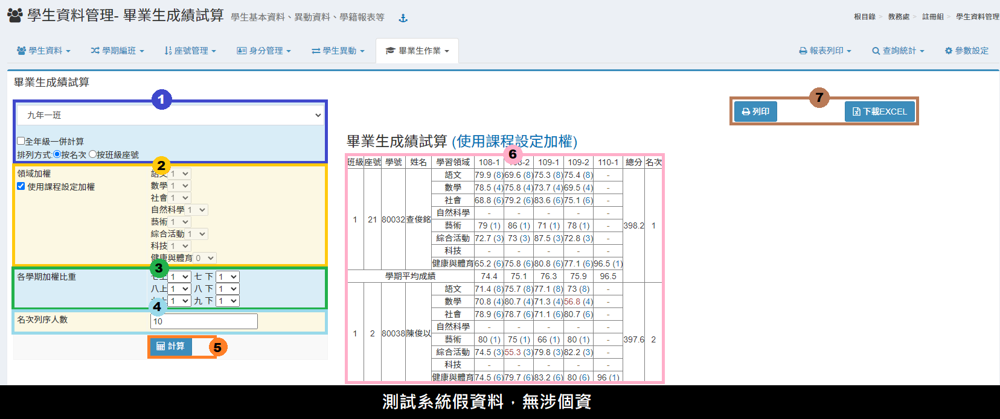

1. 選擇要計算&#x7684;**「班級」**，或勾&#x9078;**「全年級一併計算」**&#x4E26;選擇排列方式。
2. 選擇&#x5404;**「領域加權」**，或勾&#x9078;**「使用用課程設定加權」**&#x6578;值（勾選後，系統會直接運算課程加權分數，不需另外選擇右側科目權重欄位）。
3. 選擇&#x5404;**「學期加權比重」**。
4. 填&#x5165;**「名次列序人數」**。
5. 按&#x4E0B;**「計算」**。
6. 標示處顯示試算結果。
7. &#x53EF;**「列印」**，&#x6216;**「下載 Excel」**&#x6A94;案。


「領域加權」、「學期加權比重」的預設值，可至 [參數設定](sheng-liao-guan-li.md#can-shu-she-ding) 調整。


### 教育程度查記作業

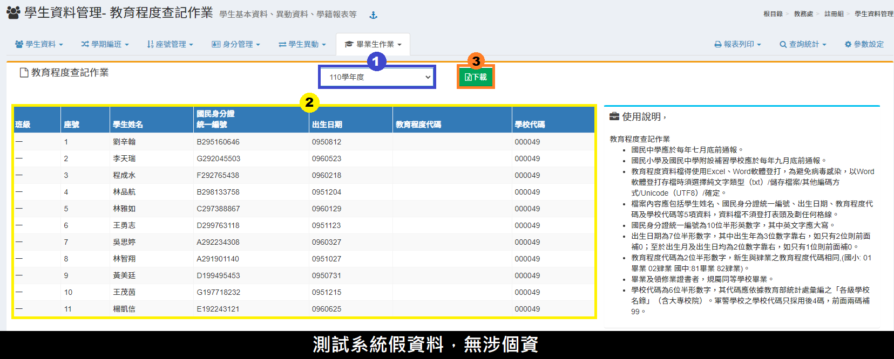

1. 選擇「**學年度**」。
2. 標示處顯示查詢結果。&#x20;
3. 可下載「**教育程度查記作業輸出檔**」。

### 畢業生本土語選修意願




* 請先在「畢業生一覽表」完成學生[「升學學校設定」](sheng-liao-guan-li.md#bian-xiu-sheng-xue-xue-xiao)作業
* 本模組為學校業務承辦人管理專用：畢業班填報本土語選修意願，請畢業班導師至「教職員>導師作業>填報事項>填報畢業班本土語選修意願」進行填報。


<figure>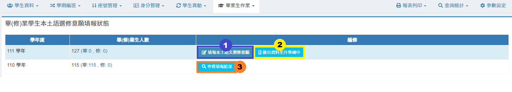<figcaption></figcaption></figure>

1. 點&#x64CA;**「填報本土語文選修意願」**&#x53EF;填寫各班級學生本土語文選修意願，詳見下列頁籤。
2. 點&#x64CA;**「匯出資料至升學國中」**&#x53EF;將選填資料匯送至升學國中，詳見下列頁籤。
3. 可查看歷&#x5E74;**「填報結果」**。




建議請應屆班級班導師由「教職員>導師作業>填報事項>填報畢業班本土語選修意願」填寫任導班級學生的本土語文選修。


<figure>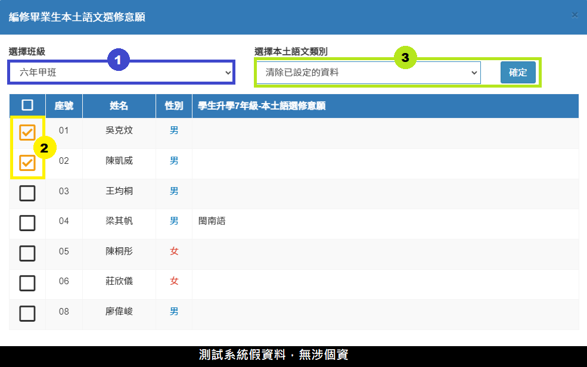<figcaption></figcaption></figure>

1. 選擇應屆畢&#x696D;**「班級」**。
2. 勾&#x9078;**「學生」**
3. 選&#x64C7;**「本土語文類別」**&#x5F8C;按確定；如須清除已設定資料，選擇＂清除已設定的資料＂後按確定。



<figure>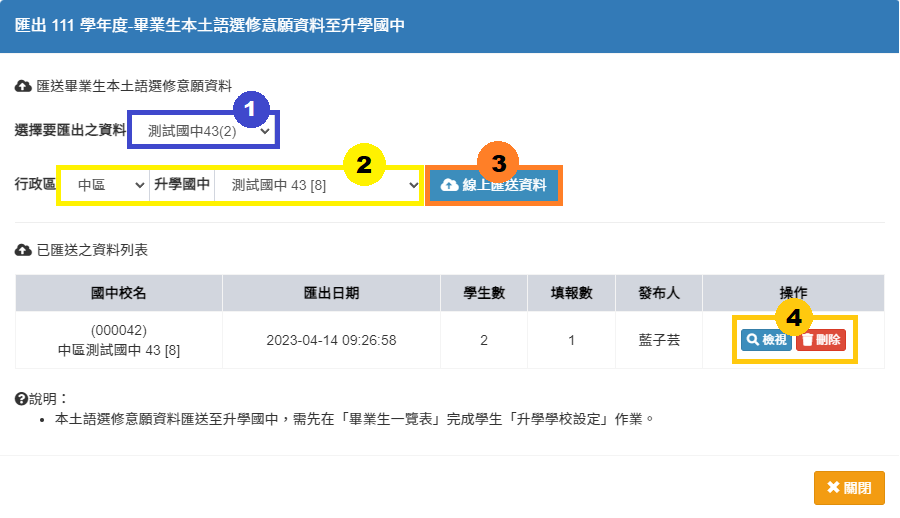<figcaption></figcaption></figure>

1. 選擇要匯出至升學國中的資料。
2. 選擇匯出的升學國中。
3. 點&#x64CA;**「線上匯送資料」**，可將資料匯給使用CS校務系統的學校。
4. &#x53EF;**「檢視」**、**「刪除」**&#x5DF2;匯送的資料。


本土語選修意願資料匯送至升學國中，需先在「畢業生一覽表」完成學生[「升學學校設定」](sheng-liao-guan-li.md#bian-xiu-sheng-xue-xue-xiao)作業。




## 報表列印

### 學籍成績記錄表

.png>)

1. 選&#x64C7;**「學期」**、**「班級」**。
2. 選&#x64C7;**「成績平均計算方式」**。
3. 勾選「**列印職章**」選項，學籍表將自動匯入教職員簽章、「**含彈性課程**」選項會顯示彈性課程成績
4. 勾&#x9078;**「全選」**&#x9078;項，可以快速選取全班的學生。
5. 標示處列出所選班級的名單，可以從名單中勾選要列印的學生。
6. 按&#x4E0B;**「確定」**&#x6309;鈕，以開新頁面方式列印所選學生的學籍紀錄。
7. 可使用學號或班級座號搜尋學生。


教職員職章請至[學校資料管理＞職稱資料](../xi-guan-li-mo/school.md#zhi-chen-zi-liao)中設定。


### 特殊生學籍表

> 本功能提供在學期間有中斷(如休學、出國)在學學籍有中斷之學生列印學籍表用。

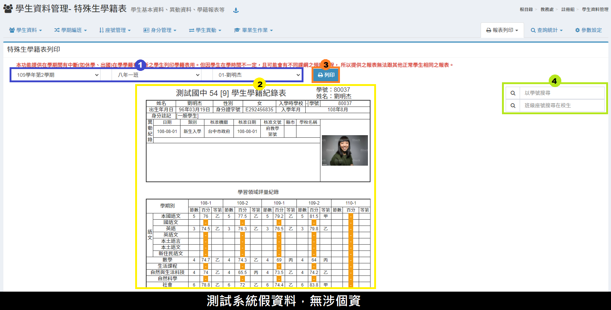

1. 選&#x64C7;**「學期」、「班級」、「學生」。**
2. 該生學籍資料表顯示於標示處2。
3. 按&#x4E0B;**「列印」**&#x6309;鈕，以開新頁面方式列印所選特殊生的學籍紀錄。
4. 可使用學號或班級座號查詢學生。

### 輔導記錄表

.png>)

1. 選&#x64C7;**「學期」**、**「班級」**。
2. 勾&#x9078;**「列印職章」**&#x9078;項，紀錄表將自動匯入教職員簽章
3. 勾&#x9078;**「全選」**&#x9078;項，可以快速選取全班的學生。
4. 標示處列出所選班級的名單，可以從名單中勾選要列印的學生。
5. 按&#x4E0B;**「確定」** 按鈕，以開新頁面方式列印所選學生的輔導記錄表。


教職員職章請至[學校資料管理＞職稱資料](../xi-guan-li-mo/school.md#zhi-chen-zi-liao)中設定。


### 名冊輸出

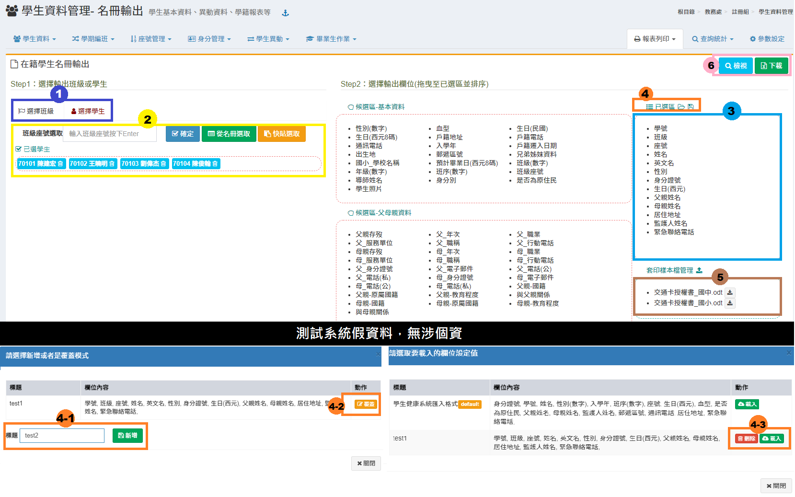

1. 選擇輸&#x51FA;**「班級」**&#x6216;**「學生」**。
2. 若是選擇學生，有輸入**座號選取**、**從名冊選取**、**快貼選取**三種方式，已選擇的學生姓名會呈現在標示處下方。
3. 將「候選區的輸出項目」**拖曳至「已選區」**。
4.  已選區的項目可&#x4EE5;**「儲存」**&#x6216;**「載入」**，方便設定學校輸出偏好\
    －**「儲存」**：按下儲存圖示，可儲存當前已選區的項目，會彈出編輯視窗。

    4-1 可輸入輸出偏好之標題。

    4-2 或覆蓋當前偏好設定。\
    －**「載入」**：按下開啟資料夾圖示，4-3 可載入或刪除已存儲的偏好設定。
5. 點擊此處下載符號，可下載國中/小學交通卡授權書
6. **「檢視」**、**「下載」**&#x5728;籍學生名冊

### 編班名冊輸出

一.採計階段成績

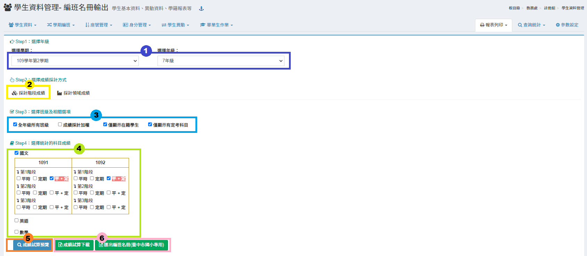

1. 選擇「**學期**」、「**年級**」。
2. 選擇成績採計方式:採計階段成績。
3. 選擇班級及相關選項。
4. 選擇統計的科目成績。
5. 按下「**成績試算預覽**」，下方將列出成績試算結果。
6. 可下載「**成績試算檔**」及「**匯出編班名冊**」。

二.採計領域成績

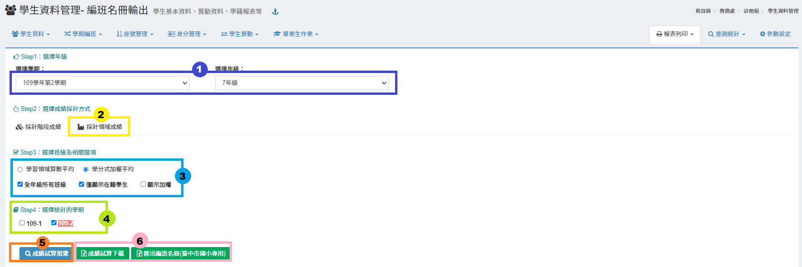

1. 選擇「**學期**」、「**年級**」。&#x20;
2. 選擇成績採計方式:採計領域成績。&#x20;
3. 勾選班級及相關選項 。&#x20;
4. 選擇統計的學期 。&#x20;
5. 按下「**成績試算預覽**」標示處可以列出成績試算結果。&#x20;
6. &#x20;可下載「**成績試算檔**」及匯出「**編班名冊**」。

### 學生證列印

#### 列印預設學生證

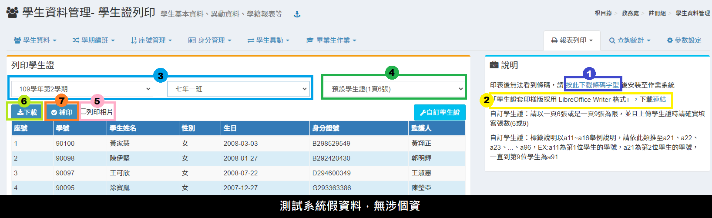

1. 下&#x8F09;**「條碼字型檔」**（使用於學號條碼）。
2. 下&#x8F09;**「LibreOffice 軟體」**，建議下載 6.0 以上版本（必須使用此軟體開啟檔案）。
3. 選&#x64C7;**「學期」**、**「班級」**。
4. 選&#x64C7;**「學生證版型」**，分為 9 張、6 張。
5. 如需列印學生大頭照，可勾&#x9078;**「列印相片」**。
6. 按&#x4E0B;**「下載」**，可下載所選班級的學生證檔案，請使用 LibreOffice 開啟、列印。
7. 選擇「學生證版型」後，按&#x4E0B;**「補印」**，在快顯示視窗中，填入要補印學生證的學號，點&#x9078;**「下載學生證」**&#x6309;鈕，即可補印學生證。

#### 自訂學生證



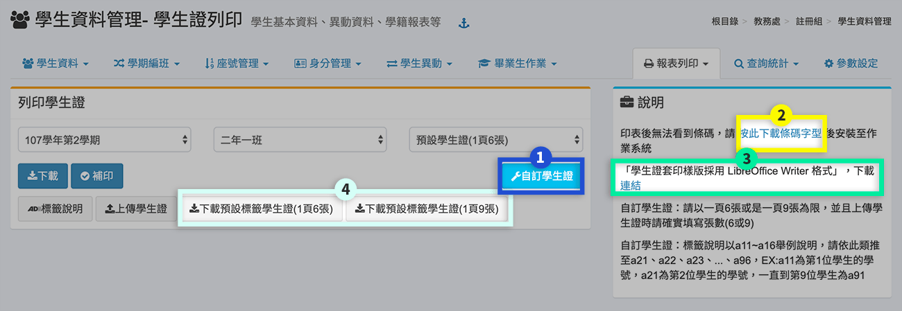

1. 按&#x4E0B;**「自訂學生證」**。
2. 下&#x8F09;**「條碼字型檔」**（使用於學號條碼）。
3. 下&#x8F09;**「LibreOffice 軟體」**，建議下載 6.0 以上版本（必須使用此軟體開啟檔案）。
4. 下&#x8F09;**「預設標籤學生證」**&#x6A94;案。



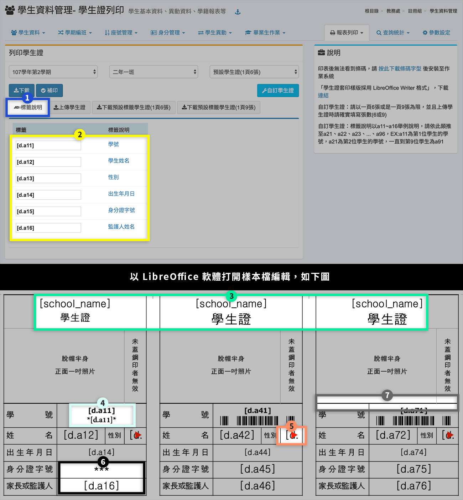

1. 按&#x4E0B;**「標籤說明」**。
2. 標示處顯示學生證「套印標籤值」，標籤都以 \[ ] 表示。\
   編碼邏輯為：以 a11 \~ a16 舉例說明，請依此類推至 a21、a22、a23、...、a96。a11 為第 1 位學生的學號，a21 為第 2 位學生的學號，一直到第 9 位學生為 a91。
3. 使用 LibreOffice 打開下載&#x7684;**「預設標籤學生證」**&#x6A94;案，可編輯所有內文的字型、字級大小、顏色等。
4. 若條碼沒有選擇到安裝的「條碼字型檔」，則不會出現條碼。
5. 表格邊界較窄時，標籤會超過欄位，如圖「性別欄」所示，屬正常現象。
6. 若「身分證字號、家長監護人」不想顯示，可將標籤取代為「\*」或其他值。
7. 表格邊界若不符合貴校購買的學生證格子，可自行調整欄寬、列寬。
8. 編輯完成後記得儲存檔案。



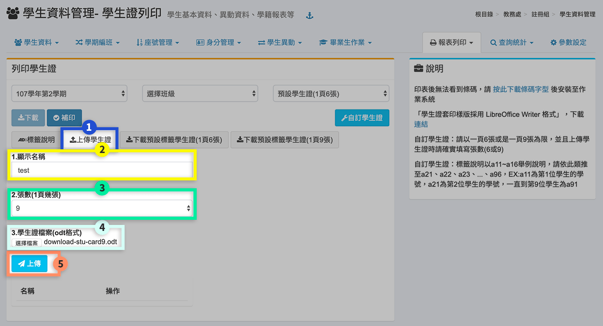

1. 按&#x4E0B;**「上傳學生證」**。
2. 填入學生&#x8B49;**「顯示名稱」**。
3. 選&#x64C7;**「一頁張數」**。
4. 選&#x64C7;**「檔案」**。
5. 按&#x4E0B;**「上傳」**。



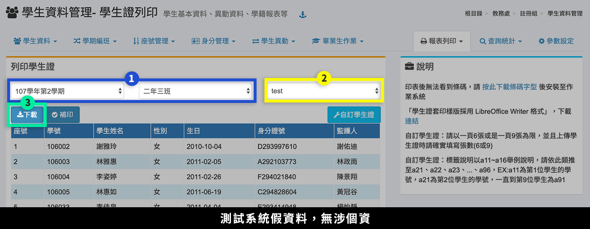

1. 選擇列印&#x4E4B;**「學期、班級」**。
2. 選擇貴校上傳&#x7684;**「自訂學生證樣本」**。
3. 按&#x4E0B;**「下載」**，使用 LibreOffice 開啟，即可列印套印好的學生證。



### 停課證明書

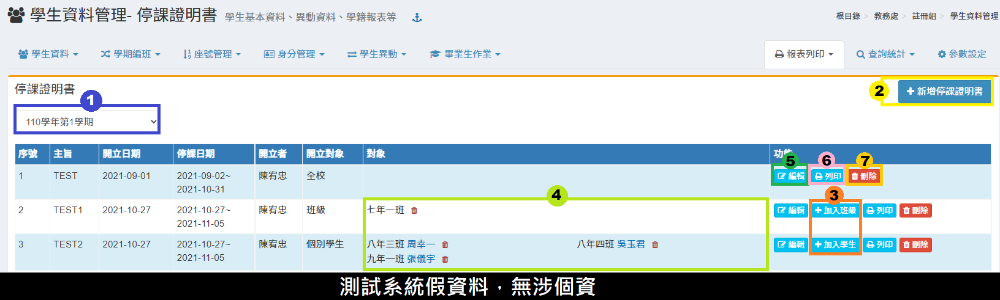

1. 選擇「**學年度學期**」。&#x20;
2. 點&#x64CA;**「新增停課證明書」**&#x53EF;新增停課證明。
3.  依停課證明開立對象：

    「班級」可於功能按下「**加入班級**」，可在該筆在學證明紀錄中加入班級。

    「個別學生」可於功能按下「**加入學生**」，可在該筆在學證明紀錄中加入學生。
4. 如欲刪除已選班級或學生，請點擊「**垃圾桶**」圖示即可。&#x20;
5. 點擊「**編輯**」按鈕可修改停課證明相關內容 。
6. 點選「**列印**」按鈕，可在新視窗中列印所加入學生的停課證明書。&#x20;
7. 點選 「**刪除**」 按鈕，可以刪除該筆資料。

### 在學證明書

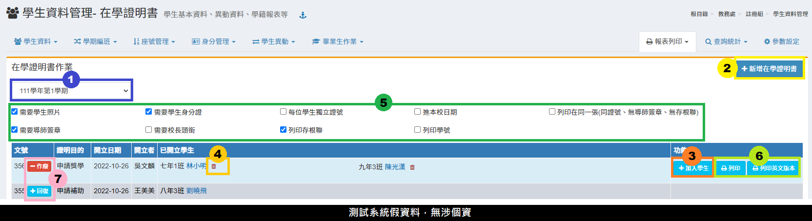

1. 選擇「**學期選單**」。
2. 按下「**新增在學證明書**」，在快顯視窗中，填入在學證明書的開立目的、開立日期。
3. 按&#x4E0B;**「加入學生」**，可在該筆在學證明紀錄中加入學生。
4. 點選學生姓名旁的垃圾桶圖示，可刪除該名學生。
5. 勾選「**輸出選項」**。
6. 按&#x4E0B;**「列印」**&#x6216;**「列印英文版本」**&#x6309;鈕，可在新視窗中列印所加入學生的在學證明書、英文版在學證明書。
7. 按&#x4E0B;**「作廢」**&#x6309;鈕，可停用該筆在學證明，亦&#x53EF;**「回復」**。

## 查詢統計

### 搜尋學生

1. 選擇一個欄位，填入要查詢的條件，若是搜尋非在籍生，請勾選「含非在學生」。
2. 按&#x4E0B;**「送出查詢」**&#x6309;鈕。
3. 標示處顯示查詢結果。
4. 按&#x4E0B;**「詳細資料」**，可檢視學生個人基本資料。

### 人數統計

1. 標示處列出本學期各班級男女生人數統計。
2. 標示處列出本學期各年級男女生人數統計。
3. 按&#x4E0B;**「列印」**&#x6309;鈕，跳出新視窗進行列印。

### 歷年總表

1. 標示處列出「歷年學生異動表統計與人數總表」。
2. 標示處列出「歷年學期資料統計表」


本表僅以每學期的學期表進行統計，未包含學生轉入轉出等異動。


### 年齡統計

1. 選&#x64C7;**「以9月1日為起始」**&#x6216;**「以9月2日為起始」**&#x7684;統計方式。
2. 標示處列出**全校學生年齡統計表**，顯示各年級男女生的年齡分布狀況。
3. 按&#x4E0B;**「列印」**&#x6309;鈕，跳出新視窗進行列印。
4. 按&#x4E0B;**「放大鏡」**&#x6309;鈕，可以顯示及列印該年齡區間內所有學生。

### 生日月分統計

1. 標示處顯示各月份生日的人數總表。
2. 按下各月份總人數，可以列出及列印該月份所有學生。

### 星座統計

1. 選&#x64C7;**「12星座」**&#x6216;**「13星座」**&#x7684;統計方式。
2. 標示處列出各班星座人數分布。

### 身分統計

.png>)

1. 選&#x64C7;**「學期」**。
2. 按下統計結果中&#x7684;**「數字」**，可查看該身分別的學生名單。
3. 按&#x4E0B;**「下載檔案」**&#x5716;示，可下載該身分別的學生資料 Excel 檔。
4. 按&#x4E0B;**「放大鏡」**&#x6309;鈕，可以開新視窗顯示該身分別所有學生。

### 原住民學生統計

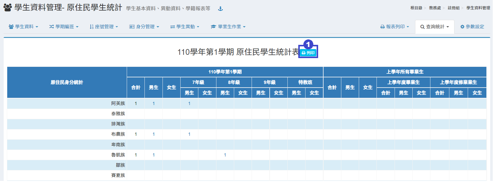

1. 可統計學期原住民學生數量，按&#x4E0B;**「列印」**&#x6309;鈕，跳出新視窗可列印原住民學生統計表。

### 就學實況查詢

1. 輸入調出生&#x7684;**「證件號碼」**。
2. 按&#x4E0B;**「開始查詢」**。
3. 搜尋結果顯示在標示處。


* 快貼資料以列為單位，一列代表查詢一個學生。
* 證照號碼：可以使用學生之「國民身分證」號碼、「居留證」號碼或者「護照」號碼查詢。
* 查詢資料庫每日清晨進行資料更新。
* 若學生辦理轉學後尚未到就讀學校辦理轉入手續，其資料將查詢不到。


### 學生資源網-學籍匯出紀錄

.png>)

1. 點&#x64CA;**「學生數明細」**&#x53EF;查看各年級學生數量。
2. 點&#x64CA;**「結果檢核」**&#x53EF;查看上傳結果，如下圖。\
   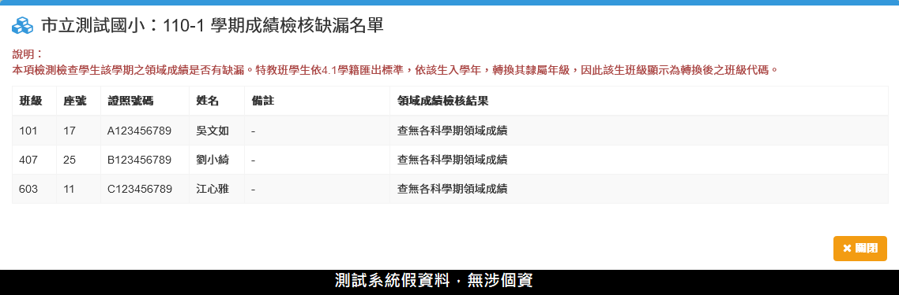
3. &#x53EF;**「下載」**&#x6AA2;核結果。
4. &#x53EF;**「匯出學籍json檔案」**，請參考下圖。\
   4-1. 於此處輸入學生身分證，每列一位(點擊ENTER鍵跳下一列)，至多20位學生。 \
   4-2.**「線上檢視學生json檔」**&#x63D0;供學校檢視學生資料json檔。\
   4-3.**「下載json檔案」**&#x7531;學校承辦人登入學生資源網，以上傳json格式檔案方式，進行補上傳作業。

<figure><figcaption></figcaption></figure>


成績檢核說明：本紀錄為學籍上傳前本系統自行檢核之結果，提供學校參考。正式檢核結果仍需依「學生資源網」檢核結果為主。



縣市學籍批次上傳學生資源網後，經過學資網檢核不通過者，在補齊缺漏之學期成績後，可透過步驟4.匯出Json格式學籍資料。並由學校承辦人再登入學生資源網，以上傳json格式檔案方式，進行補上傳作業。



* 國民中小學學生資源網-填報學籍資料：係指學期結束後，由縣市或學校上傳學籍資料至該系統，建立全國各校學籍資料庫。
* 本系統採用 SFTP 方式上傳縣市學籍資料，於每學期結束後統一批次匯出各校學籍資料，並檢核匯出紀錄，再上傳至學生資源網。
* 針對學生確有無成績之情節(例如實驗教育學生、身心障礙學生、因疫情影響無法返臺就學之外籍生)，請依照「學生資源網」有關學籍資料匯入注意事項公告進行檢核。
* 身心障礙學生：學生身分別設定為「本人身心障礙(身心障礙生)」，並且至「[身分別-子類別設定及統計](https://school.tc.edu.tw/student/identity-sub-kind/subkind)」加註手冊核定日期。
* 非學校型態學生：至「[學生基本資料](https://school.tc.edu.tw/student/student-data/index)-學生狀況」依據該生之學習型態進行設定。


## 參數設定

> 進入參數設定頁面後可進行各項參數調整。

<figure>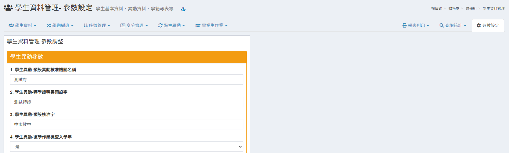<figcaption></figcaption></figure>
