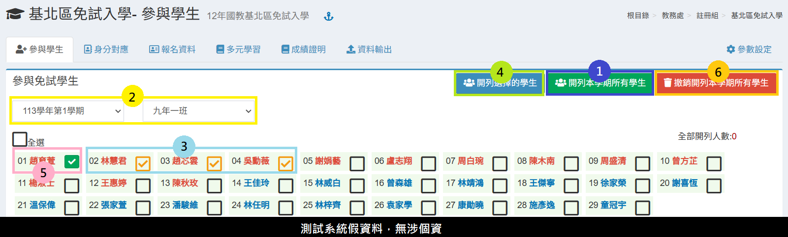
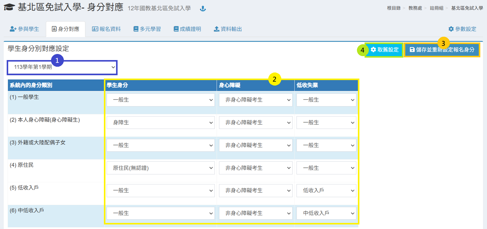
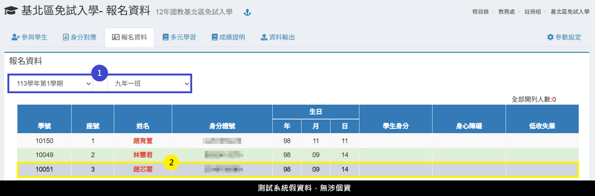
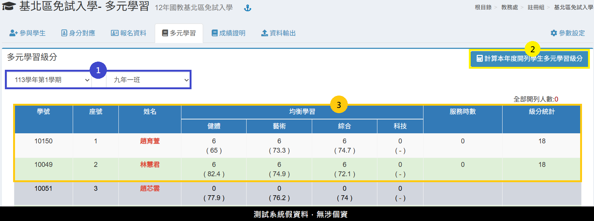
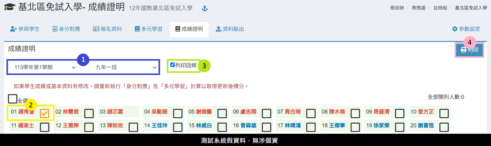
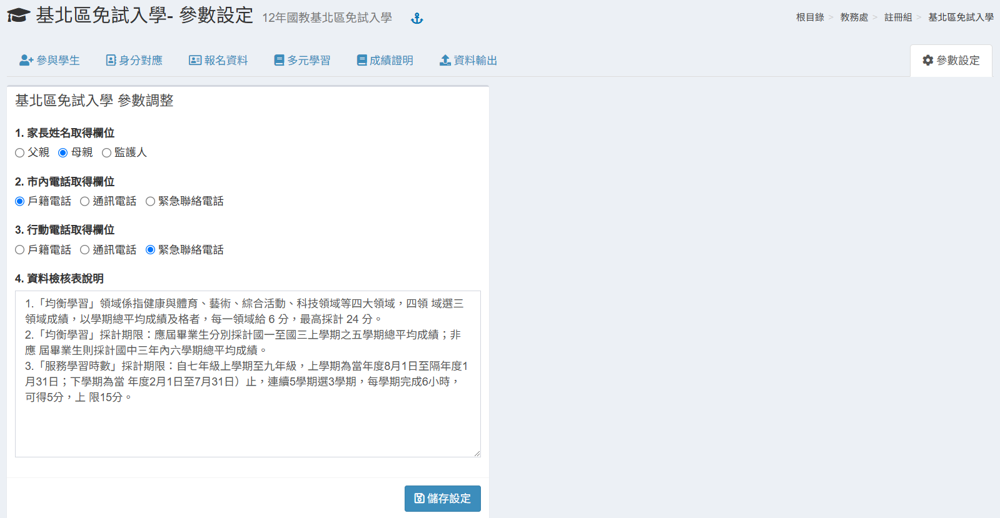

# 基北區免試入學

## 參與學生

<figure><figcaption></figcaption></figure>

1. 若要開列所有學生，直接按&#x4E0B;**「開列本學期所有學生」**。
2. 若要開列部分學生，先選&#x64C7;**「學期」**、**「班級」**。
3. 在學生列表中勾選或全選要開列的學生。
4. 按&#x4E0B;**「開列選擇的學生」**。
5. 已開列學生可以個別撤銷開列，請雙擊滑鼠點選該學生:white\_check\_mark:圖示。
6. 要刪除開列紀錄，按&#x4E0B;**「撤銷開列本學期所有學生」**。

## 身分對應

<figure><figcaption></figcaption></figure>

1. 選&#x64C7;**「學期」**。
2. 依序設定系統對應基北免試入學身分。\
   畫面左手邊為 「校務系統內身分類別 」，與右手邊「 免試入學身分資料 」進行身分對應，完成對應後系統會抓取學生於校務系統上的身分別去進行對應。
3. 按&#x4E0B;**「 儲存並重新設定報名身分 」**，可將對應設定儲存，並且將設定套用到已開列學生。
4. 若上學期已有相關設定，可點&#x64CA;**「 取舊設定 」**，系統會自動複製上學期的身分對應設定，點擊後請需 **「 儲存並重新設定報名身分 」。**


如果於設定好身分對應後後，還有再新增開列學生，或者有更新學生身分別資料，請於匯出免試入學報名資料前再次執行本功能。


## 報名資料

<figure><figcaption></figcaption></figure>

1. 選&#x64C7;**「學期」**、**「班級」**，下方會列出該班學生報名資料。
2. 沒有開列的學生會呈現灰底。

## 多元學習

<figure><figcaption></figcaption></figure>

1. 選&#x64C7;**「學期」**、**「班級」**。
2. 多元學習計算由系統內資料計算，按&#x4E0B;**「重計本年度開列學生多元學習級分」**&#x6309;鈕計算。
3. 下方會顯示出學生各項檢核項目統計後的結果。


本模組會依據本系統之學生成績模組、[學生服務學習模組](../undefined/sheng-fu.md)分別計算出各項積分。


## 成績證明

<figure><figcaption></figcaption></figure>

1. 選&#x64C7;**「學期」**、**「班級」。**
2. 選&#x64C7;**「學生」**&#x6216;**「全選」**&#x5B78;生。
3. 若有需要回條，請勾&#x9078;**「列印回條」**。
4. 點&#x64CA;**「列印」**&#x5217;印學生成績證明單，沒有開列之學生無法列印。


* 如果學生成績或基本資料有修改，請重新執行「身分對應」及「多元學習」計算以取得更新後積分。
* 資料檢核表說明內容請至[**「 參數設定 」**](ji-bei-qu-mian-shi-ru-xue.md#can-shu-she-ding)調整。


## 資料輸出

<figure><figcaption></figcaption></figure>

於此模組可匯&#x51FA;**「 學生基本資料檔 」**&#x6216;**「 學生比序項目匯入檔 」**。


如果學生成績或基本資料有修改，請重新執行「身分對應」及「多元學習」計算以取得更新後積分。


## 參數設定

<figure><figcaption></figcaption></figure>

可於此模組設定基北免試入學的參數內容。
