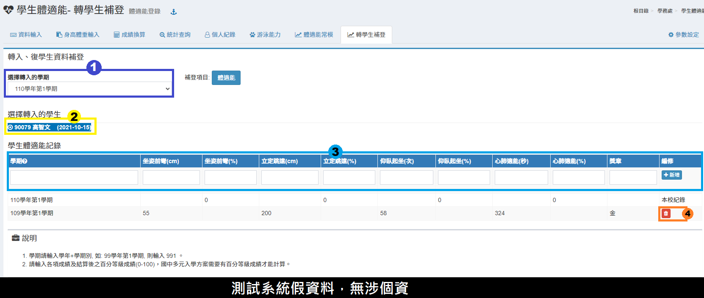

# 學生體適能

## 資料輸入


* 系統預設 **體育組長** 可以輸入全校成績，**體育任課老師** 可以輸入該班成績。
* 系統管理員須先**授權「資料輸入、成績換算」**&#x6A21;組給**體育組長**與**體育任課老師**。
* [參數設定](sheng-neng.md#can-shu-she-ding) 可設定「可輸入全校體適能成績」的職稱。


1. 選&#x64C7;**「學期」**、**「班級」**。
2. 在成績欄為按&#x4E0B;**「箭號圖示」**，可依座號序輸入學生成績。
3. 標示處可統一設定**該班**或**全校**&#x7684;**「檢測日期」**、**「檢測單位」**。
4. 若成績建立在 Excel，也可以使&#x7528;**「成績資料快貼匯入」**，請依照說明格式貼上。
5. 輸入完成後，&#x53EF;**「下載該班、全校體適能成績」**。

## 身高體重輸入


本模組建議授權給貴校**護理師**，護理師可直接匯入全校學生身高體重資料。


1. 選&#x64C7;**「學期」**、**「班級」**。
2. 在身高、體重欄位按&#x4E0B;**「箭號圖示」**，可依座號序輸入學生成績。
3. 或直接使&#x7528;**「身高體重快貼匯入」**。
4. 在 Excel 中的學號、身高、體重欄位複製，貼在標示處。
5. 快貼完成請按&#x4E0B;**「存檔」**。

## 成績換算

1. 選&#x64C7;**「學期」**、**「班級」**。
2. 按&#x4E0B;**「換算該班成績」**、**「換算全校成績」**。
3. 標示處顯&#x793A;**「換算結果」**。
4. &#x53EF;**「列印換算結果」**。

## 統計查詢




1. 選&#x64C7;**「學期」**。
2. 選擇要統計&#x7684;**「獎章」**。
3. 標示處顯示獲得獎章的學生資料。
4. &#x53EF;**「下載查詢 Excel 檔」**。




1. 選&#x64C7;**「學期」**。
2. 選&#x64C7;**「平均對象」**。
3. 標示處顯&#x793A;**「統計結果」**。



## 個人紀錄

.png>)

1. 選&#x64C7;**「學期」**、**「班級」**、**「學生」**。
2. 標示處顯示該生體適能紀錄。
3. &#x53EF;**「列印該生或全班」**&#x7684;體適能成績。

## 游泳能力

1. 選&#x64C7;**「學期」**、**「班級」**。
2. 輸入學生測驗成績。
3. 可統一設&#x5B9A;**「檢測日期」**。
4. 按&#x4E0B;**「儲存」。**
5. &#x53EF;**「下載該本或全校」**&#x7684;游泳能力紀錄。

## 體適能常模


資料來源：

* 7-9歲數據來自教育部「86年臺閩地區中小學學生體適能檢測資料處理─常模研究」
* 10-18歲數據來自教育部「101年臺灣中小學學生體適能常模」


1. 選&#x64C7;**「體適能項目」**。
2. 標示處顯示體適能百分等級常模。

## 轉學生補登

本功能可以補登學生體適能紀錄。

1. 選&#x64C7;**「轉入學期」**。
2. 選&#x64C7;**「轉入學生」**。
3. 依照圖片中的項目，補登學生在他校的體適能紀錄內容。輸入完畢後，按&#x4E0B;**「新增」**&#x5132;存學生在他校體適能新增紀錄。&#x20;
4. 若要刪除學生補登紀錄點擊垃圾桶圖示即可刪除。


學期請輸入學年+學期別, 如: 99學年第1學期, 則輸入 991 。


## 參數設定

1. 可輸入全校體適能成績的職稱，多個職稱以逗號隔開，例如：\
   `體育組長,體衛組長,校長`
