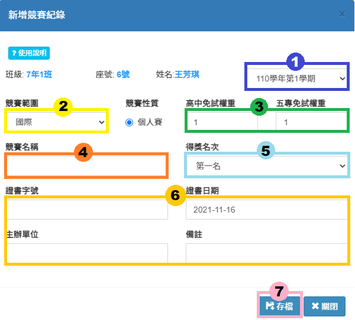
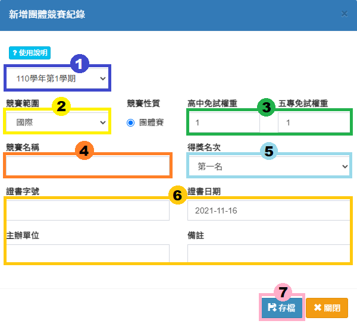
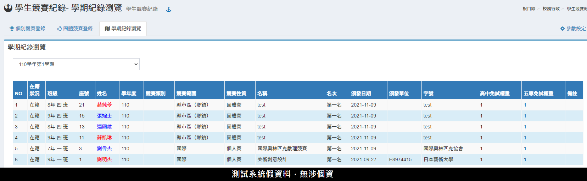

# 學生競賽紀錄

## 個別競賽登錄




1. 選擇學期、班級、學生。
2. 或者直接輸入學號、班級座號搜尋。
3. 點&#x9078;**「新增紀錄」**，增加一筆學生個人競賽紀錄。
4. 新增完成後，亦&#x53EF;**「編輯或刪除」**&#x7D00;錄。
5. &#x53EF;**「列印」**&#x5B78;生個人或全班競賽紀錄。


團體登錄與編輯請至 [團體競賽登錄](sheng.md#tuan-ti-jing-sai-deng-lu)。





1. 選&#x64C7;**「學年度學期」**。
2. 選&#x64C7;**「競賽範圍」**：國際、全國、區域性、縣市、區鄉鎮、校內。
3. 輸&#x5165;**「免試權重」**。
4. 輸&#x5165;**「競賽名稱」**。（必填）
5. 選&#x64C7;**「得獎名次」**。
6. 輸&#x5165;**「證書字號」**、**「證書日期」**、**「主辦單位」**、**「備註」**。
7. 按&#x4E0B;**「存檔」**，儲存競賽紀錄。



## 團體競賽登錄



.png>)

1. 按&#x4E0B;**「新增團體競賽紀錄」**，新增一筆團體競賽紀錄。
2. 亦可使&#x7528;**「快貼功能」匯入**團體競賽紀錄。
3. 點&#x9078;**「列表」**，可查看即時填報狀況。
4. 按&#x4E0B;**「填報」**，登錄學生團體競賽紀錄。
5. 按&#x4E0B;**「修改設定」**，可編輯競賽內容。
6. 點&#x9078;**「刪除」**，刪除該紀錄。（已有學生填報時，須先刪除所有登錄學生，才能刪除整筆紀錄）




1. 選&#x64C7;**「學年度學期」**。
2. 選&#x64C7;**「競賽範圍」**：國際、全國、區域性、縣市、區鄉鎮、校內。
3. 輸&#x5165;**「免試權重」**。
4. 輸&#x5165;**「競賽名稱」**。（必填）
5. 選&#x64C7;**「得獎名次」**。
6. 輸&#x5165;**「證書字號」**、**「證書日期」**、**「主辦單位」**、**「備註」**。
7. 按&#x4E0B;**「存檔」**，儲存競賽紀錄。



在團體競賽登錄頁面，選擇一筆紀錄，按&#x4E0B;**「填報」**。

1. 選&#x64C7;**「班級」**。
2. 選&#x64C7;**「學生」**，可複選。
3. 按&#x4E0B;**「選擇」**。
4. 成功選取的學生會顯示在標示處。
5. 按&#x4E0B;**「儲存」**，儲存該次填報紀錄。



## 學期紀錄瀏覽

本功能可瀏覽整學期全校學生競賽紀錄列表。

## 參數設定

1.  學生個人競賽紀錄排序方式

    `依證書日期最新在上`

    `依證書日期最舊在上`

    `最新新增在上`
